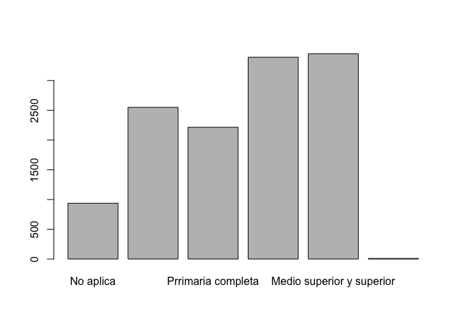
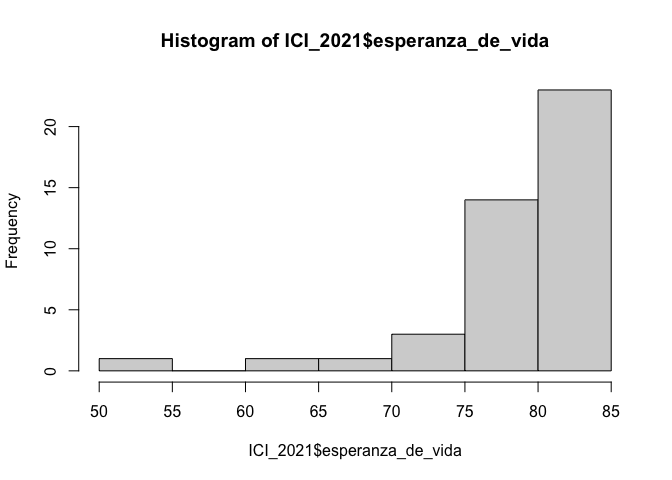
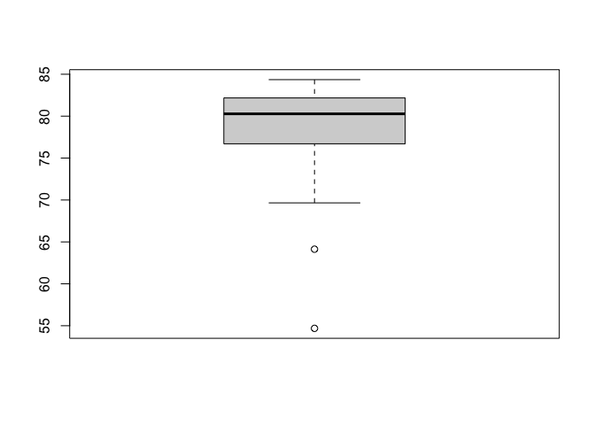
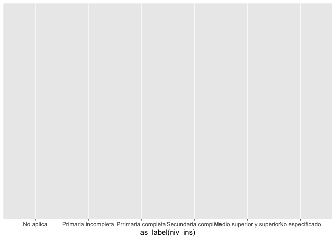
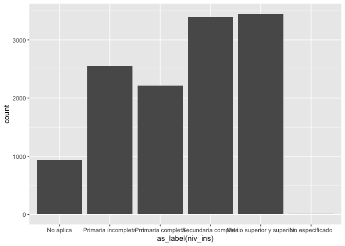
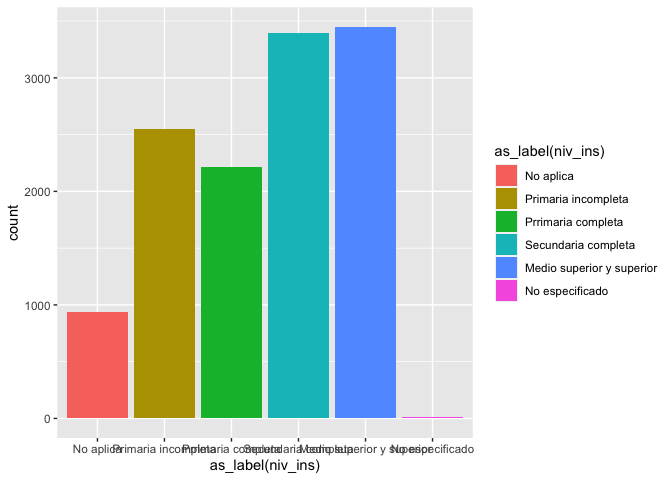
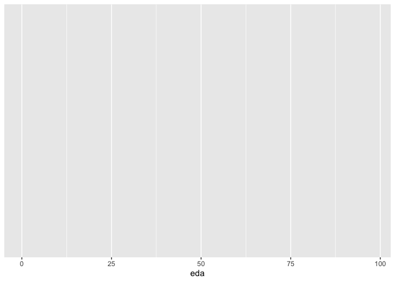
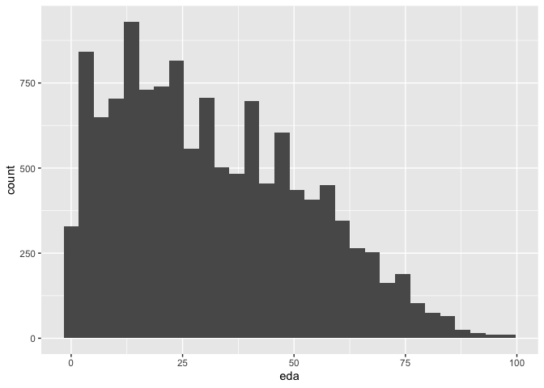
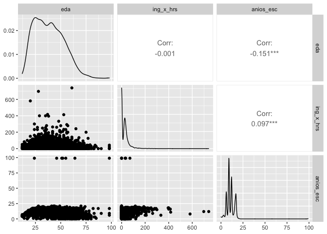

Práctica 2
================
Ana Escoto
1/11/2022

-   [Paquetes](#paquetes)
-   [Cargando los datos](#cargando-los-datos)
-   [Visualización de datos, un pequeño
    disclaimer](#visualización-de-datos-un-pequeño-disclaimer)
    -   [Gráficos de base](#gráficos-de-base)
-   [*Grammar of graphics: ggplot*](#grammar-of-graphics-ggplot)
-   [Un lienzo para dibujar](#un-lienzo-para-dibujar)
-   [Gráficos univariados](#gráficos-univariados)
    -   [Para cualitativas](#para-cualitativas)
    -   [Para variables cuantitativas](#para-variables-cuantitativas)
    -   [Intro a dos variables](#intro-a-dos-variables)
-   [Introducción a la inferencia](#introducción-a-la-inferencia)
    -   [Hipótesis e intervalos de
        confianza](#hipótesis-e-intervalos-de-confianza)
    -   [Proporción](#proporción)
-   [Estimaciones bivariadas](#estimaciones-bivariadas)
    -   [Diferencias de medias por
        grupos](#diferencias-de-medias-por-grupos)
    -   [Diferencias de proporciones.](#diferencias-de-proporciones)
-   [Estimación de varianzas y sus pruebas de
    hipótesis](#estimación-de-varianzas-y-sus-pruebas-de-hipótesis)
-   [Estimación de diferencias de varianzas y sus pruebas de
    hipótesis](#estimación-de-diferencias-de-varianzas-y-sus-pruebas-de-hipótesis)
-   [Prueba chi-cuadrado chi-sq. Una aplicación más
    común](#prueba-chi-cuadrado-chi-sq-una-aplicación-más-común)

# Paquetes

``` r
if (!require("pacman")) install.packages("pacman")#instala pacman si se requiere
```

    ## Loading required package: pacman

``` r
pacman::p_load(tidyverse,
               readxl,
               writexl, 
               haven,
               sjlabelled, 
               janitor,
               infer, 
               ggpubr,
               magrittr,
               gt,
               GGally,
               broom,
               DescTools,
               wesanderson)
```

# Cargando los datos

Desde STATA

``` r
ags_t321 <- read_dta("./datos/AGS_SDEMT321.dta", encoding="latin1") %>% 
  clean_names()
```

Desde Excel:

``` r
ICI_2021 <- read_excel("./datos/ICI_2021.xlsx",
                               sheet = "para_importar") %>% 
  clean_names()
```

    ## New names:
    ## * `` -> ...2

``` r
ags_t321 %<>%
  filter(r_def==0) %>% 
  filter(!c_res==2)
```

# Visualización de datos, un pequeño disclaimer

Hay cursos específicos de visualización de datos. Es maravilloso pero
también requiere que estudiemos bien qué tipo de datos tenemos y cuáles
son nuestros objetivos.

Me gusta mucho este recurso: <https://www.data-to-viz.com/>

## Gráficos de base

“plot()” Es la función más simple.

``` r
  plot(as_label(ags_t321$niv_ins))
```

<!-- -->

Esto es igual que:

``` r
barplot(table(as_label(ags_t321$niv_ins)))
```

<!-- -->

Histograma y el boxplot

``` r
hist(ICI_2021$esperanza_de_vida)
```

<!-- -->

``` r
boxplot(ICI_2021$esperanza_de_vida)
```

<!-- -->

# *Grammar of graphics: ggplot*

Hoy vamos a presentar a un gran paquete ¡Es de los famosos! Y tiene más
de diez años.

-   <https://qz.com/1007328/all-hail-ggplot2-the-code-powering-all-those-excellent-charts-is-10-years-old/>

“gg” proviene de “Grammar of Graphics”, funciona un poco como
sintácticamente, de ahí su nombre.

Algunos recursos para aprender ggplot

-   <https://ggplot2-book.org/> hecha por el mero mero.

-   <http://sape.inf.usi.ch/quick-reference/ggplot2>

-   <https://raw.githubusercontent.com/rstudio/cheatsheets/master/data-visualization-2.1.pdf>

Vamos a revisar una presentación que es muy interesante

-   <https://evamaerey.github.io/ggplot2_grammar_guide/ggplot2_grammar_guide.html>

-   <https://huygens.science.uva.nl/ggPlotteR/> Hace gráficos de ggplot
    con la base de datos de Gapminder

# Un lienzo para dibujar

Para hacer un gráfico, ggplot2 tiene el comando “ggplot()”. Hacer
gráficos con esta función tiene una lógica aditiva. Lo ideal es que
iniciemos estableciendo el mapeo estético de nuestro gráfico, con el
comando aes()

``` r
g1<-ags_t321 %>%
  ggplot(aes(as_label(niv_ins)))

g1 # imprime el lienzo
```

<!-- -->

# Gráficos univariados

## Para cualitativas

``` r
g1 + geom_bar()
```

<!-- -->

``` r
g1 +  geom_bar(aes(
  fill = as_label(niv_ins)
  )) # colorea la geometría
```

<!-- -->

``` r
# Esto es equivalente

ags_t321 %>%
  ggplot(aes(as_label(niv_ins),
             fill = as_label(niv_ins)
             )
         ) + geom_bar()
```

<!-- -->

## Para variables cuantitativas

Podemos hacer histogramas y gráficos de densidad, de manera fácil. La
idea es agregar en nuestro “lienzo” una geometría, un valor para dibujar
en él. Esto se agrega con un “+” y con la figura que se añadirá a
nuestro gráfico.

``` r
g2<-ags_t321 %>%
  ggplot(aes(eda))

g2 # imprime el lienzo
```

<!-- -->

### Histograma

``` r
g2 + geom_histogram() 
```

    ## `stat_bin()` using `bins = 30`. Pick better value with `binwidth`.

<!-- -->

## Intro a dos variables

Vamos a terminar con un código que resume mucho de lo que hemos visto
hoy:

``` r
ags_t321 %>% 
  filter(clase2==1) %>%  # nos quedamos sólo con los ocupados
  select(eda, ing_x_hrs, anios_esc) %>% 
  GGally::ggpairs()
```

<!-- -->

# Introducción a la inferencia

## Hipótesis e intervalos de confianza

### t-test

Este comando nos sirve para calcular diferentes tipos de test, que
tienen como base la distribución t

<b>Univariado para estimación</b>

``` r
t.test(ags_t321$ing_x_hrs) # pero no tenemos los filtro
```

    ## 
    ##  One Sample t-test
    ## 
    ## data:  ags_t321$ing_x_hrs
    ## t = 44.423, df = 12552, p-value < 2.2e-16
    ## alternative hypothesis: true mean is not equal to 0
    ## 95 percent confidence interval:
    ##  10.46951 11.43609
    ## sample estimates:
    ## mean of x 
    ##   10.9528

Un truco para poder utilizar funciones de base con formato *tidy*

``` r
ags_t321 %>% 
  filter(clase2==1) %>% #Filtro de ocupados
  filter(ing_x_hrs>0) %>% #Filtros de quienes reportaron ingresos
  with(
    t.test(ing_x_hrs)
  )
```

    ## 
    ##  One Sample t-test
    ## 
    ## data:  ing_x_hrs
    ## t = 60.311, df = 3209, p-value < 2.2e-16
    ## alternative hypothesis: true mean is not equal to 0
    ## 95 percent confidence interval:
    ##  41.43947 44.22440
    ## sample estimates:
    ## mean of x 
    ##  42.83193

Vamos a quedarnos a con esta población objetivo:

<b>Univariado para hipótesis específica</b>

*H*<sub>*o*</sub> : *μ* = 40
*H*<sub>*a*1</sub> : *μ* &lt; 40
*H*<sub>*a*2</sub> : *μ* ≠ 40
*H*<sub>*a*3</sub> : *μ* &gt; 40
Si hacemos explícita la *H*<sub>0</sub>

``` r
ags_t321 %>% 
  filter(clase2==1) %>% #Filtro de ocupados
  filter(ing_x_hrs>0) %>% #Filtros de quienes reportaron ingresos
  with(
    t.test(ags_t321$ing_x_hrs, mu=40)
    )
```

    ## 
    ##  One Sample t-test
    ## 
    ## data:  ags_t321$ing_x_hrs
    ## t = -117.81, df = 12552, p-value < 2.2e-16
    ## alternative hypothesis: true mean is not equal to 40
    ## 95 percent confidence interval:
    ##  10.46951 11.43609
    ## sample estimates:
    ## mean of x 
    ##   10.9528

Para hacer explícitas las hipótesis alternativas

``` r
ags_t321 %>% 
  filter(clase2==1) %>% #Filtro de ocupados
  filter(ing_x_hrs>0) %>% #Filtros de quienes reportaron ingresos
  with(
  t.test(ags_t321$ing_x_hrs, mu=40, alternative = "two.sided") #default y de dos colas
    )
```

    ## 
    ##  One Sample t-test
    ## 
    ## data:  ags_t321$ing_x_hrs
    ## t = -117.81, df = 12552, p-value < 2.2e-16
    ## alternative hypothesis: true mean is not equal to 40
    ## 95 percent confidence interval:
    ##  10.46951 11.43609
    ## sample estimates:
    ## mean of x 
    ##   10.9528

``` r
ags_t321 %>% 
  filter(clase2==1) %>% #Filtro de ocupados
  filter(ing_x_hrs>0) %>% #Filtros de quienes reportaron ingresos
  with(
  t.test(ags_t321$ing_x_hrs, mu=40, alternative = "greater") # cola derecha
    )
```

    ## 
    ##  One Sample t-test
    ## 
    ## data:  ags_t321$ing_x_hrs
    ## t = -117.81, df = 12552, p-value = 1
    ## alternative hypothesis: true mean is greater than 40
    ## 95 percent confidence interval:
    ##  10.54722      Inf
    ## sample estimates:
    ## mean of x 
    ##   10.9528

``` r
ags_t321 %>% 
  filter(clase2==1) %>% #Filtro de ocupados
  filter(ing_x_hrs>0) %>% #Filtros de quienes reportaron ingresos
  with(
  t.test(ags_t321$ing_x_hrs, mu=40, alternative = "less") # cola izquierda
    )
```

    ## 
    ##  One Sample t-test
    ## 
    ## data:  ags_t321$ing_x_hrs
    ## t = -117.81, df = 12552, p-value < 2.2e-16
    ## alternative hypothesis: true mean is less than 40
    ## 95 percent confidence interval:
    ##      -Inf 11.35838
    ## sample estimates:
    ## mean of x 
    ##   10.9528

### Enchulando un poquito

Los resultados tienen la info, pero la podemos almacenar en un objeto.
Con los cálculos de modelos es muy útil guardarlos para compararlos.

``` r
t.test0<-ags_t321 %>% 
  filter(clase2==1) %>% #Filtro de ocupados
  filter(ing_x_hrs>0) %>% #Filtros de quienes reportaron ingresos
  with(
    t.test(ags_t321$ing_x_hrs, mu=40)
    )
```

Veamos si lo imprimimos

``` r
t.test0
```

    ## 
    ##  One Sample t-test
    ## 
    ## data:  ags_t321$ing_x_hrs
    ## t = -117.81, df = 12552, p-value < 2.2e-16
    ## alternative hypothesis: true mean is not equal to 40
    ## 95 percent confidence interval:
    ##  10.46951 11.43609
    ## sample estimates:
    ## mean of x 
    ##   10.9528

``` r
broom::tidy(t.test0)
```

    ## # A tibble: 1 × 8
    ##   estimate statistic p.value parameter conf.low conf.high method     alternative
    ##      <dbl>     <dbl>   <dbl>     <dbl>    <dbl>     <dbl> <chr>      <chr>      
    ## 1     11.0     -118.       0     12552     10.5      11.4 One Sampl… two.sided

La función “tidy()” hace que el resultado se vuelva un “tibble”, una
tabla muy compatible con el tidyverse. Esto puede ser útil cuando
queremos ir comparando estimaciones.

Anteriormente vimos con base cómo hacer inferencia. El paquete “infer”
tiene también elementos para inferencia, pero en formato más compatible
con tidyverse.

``` r
ags_t321 %>% 
  filter(clase2==1) %>% #Filtro de ocupados
  filter(ing_x_hrs>0) %>% #Filtros de quienes reportaron ingresos
  infer::t_test(response = ing_x_hrs, mu = 40)
```

    ## # A tibble: 1 × 7
    ##   statistic  t_df   p_value alternative estimate lower_ci upper_ci
    ##       <dbl> <dbl>     <dbl> <chr>          <dbl>    <dbl>    <dbl>
    ## 1      3.99  3209 0.0000682 two.sided       42.8     41.4     44.2

Como vemos nos da el mismo resultado anterior, pero nos da directamente
el resultado en formato tidy.

Si solo queremos el estimador de “t”

``` r
ags_t321 %>% 
t_stat(response = ing_x_hrs, mu = 40)
```

    ## Warning: The t_stat() wrapper has been deprecated in favor of the more general
    ## observe(). Please use that function instead.

    ##         t 
    ## -117.8112

Más de este paquete <https://infer.netlify.app/>

## Proporción

Vamos a revisar la proporción de hombres y mujeres en términos de
participación laboral.

El comando de base es menos flexible:

``` r
prop<-table(ags_t321[ags_t321$clase1>0,]$clase1)
prop.test(prop)
```

    ## 
    ##  1-sample proportions test with continuity correction
    ## 
    ## data:  prop, null probability 0.5
    ## X-squared = 114.59, df = 1, p-value < 2.2e-16
    ## alternative hypothesis: true p is not equal to 0.5
    ## 95 percent confidence interval:
    ##  0.5436968 0.5632517
    ## sample estimates:
    ##         p 
    ## 0.5534949

Los filtros se complican un poco…

``` r
ags_t321 %>% 
  filter(eda>14 & eda<99) %>% 
  mutate(clase1=as_label(clase1)) %>% #oo
  tabyl(clase1)
```

    ##                              clase1    n   percent
    ##                           No aplica    0 0.0000000
    ##     Población económicamente activa 5518 0.5913621
    ##  Población no económicamente activa 3813 0.4086379

Vamos a aprovechar para re-etiquetar la variable clase1

``` r
etiqueta_pea<-c("PEA", "PNEA") # un vector con las etiquetas
```

``` r
ags_t321 %>% 
  filter(eda>14 & eda<99) %>% 
  sjlabelled::set_labels(clase1, labels=etiqueta_pea) %>% 
  mutate(clase1=as_label(clase1)) %>% 
  tabyl(clase1)
```

    ##  clase1    n   percent
    ##     PEA 5518 0.5913621
    ##    PNEA 3813 0.4086379

En formato tidy

``` r
ags_t321 %>% 
  filter(eda>14 & eda<99) %>% 
  with(
    table(clase1)
    ) %>% 
  prop.test()
```

    ## 
    ##  1-sample proportions test with continuity correction
    ## 
    ## data:  ., null probability 0.5
    ## X-squared = 311.18, df = 1, p-value < 2.2e-16
    ## alternative hypothesis: true p is not equal to 0.5
    ## 95 percent confidence interval:
    ##  0.5812985 0.6013502
    ## sample estimates:
    ##         p 
    ## 0.5913621

En base necesita que se alimente de un objeto tipo table, el cual es
menos manejable. Por eso utilizaremos más el paquete *infer*

``` r
ags_t321 %>% 
  filter(eda>14 & eda<99) %>% 
  set_labels(clase1, labels=etiqueta_pea) %>% 
  mutate(clase1=as_label(clase1)) %>%   
  infer::prop_test(clase1 ~ NULL  ,
             p=0.7, 
            alternative="less")
```

    ## # A tibble: 1 × 4
    ##   statistic chisq_df   p_value alternative
    ##       <dbl>    <int>     <dbl> <chr>      
    ## 1      524.        1 3.01e-116 less

``` r
# Para que nos dé Z
ags_t321 %>% 
  filter(eda>14 & eda<99) %>% 
  set_labels(clase1, labels=etiqueta_pea) %>% 
  mutate(clase1=as_label(clase1)) %>%   
  infer::prop_test(clase1 ~ NULL  ,
            p=0.7, 
            alternative="less",
            success = "PEA", # necesitamos establecer el éxito
            z=TRUE)
```

    ## # A tibble: 1 × 3
    ##   statistic   p_value alternative
    ##       <dbl>     <dbl> <chr>      
    ## 1     -22.9 2.32e-116 less

# Estimaciones bivariadas

## Diferencias de medias por grupos

¿Podemos decir, con significancia estadística que los valores medios de
una variable son diferentes entre los grupos?

``` r
ags_t321 %>% 
    filter(ags_t321$clase2==1) %>% # nos quedamos con los trabajadores
    filter(ing_x_hrs>0) %>% #Filtros de quienes reportaron ingresos
    group_by(as_label(sex)) %>%
    summarise(avg_hrs = mean(ing_x_hrs, na.rm=T))
```

    ## # A tibble: 2 × 2
    ##   `as_label(sex)` avg_hrs
    ##   <fct>             <dbl>
    ## 1 Hombre             42.6
    ## 2 Mujer              43.1

``` r
ags_t321 %>% 
    filter(ags_t321$clase2==1) %>% # nos quedamos con los trabajadores
    filter(ing_x_hrs>0) %>% #Filtros de quienes reportaron ingresos 
    with(
      t.test(ing_x_hrs~sex)
      )
```

    ## 
    ##  Welch Two Sample t-test
    ## 
    ## data:  ing_x_hrs by sex
    ## t = -0.33904, df = 2944, p-value = 0.7346
    ## alternative hypothesis: true difference in means between group 1 and group 2 is not equal to 0
    ## 95 percent confidence interval:
    ##  -3.251105  2.292553
    ## sample estimates:
    ## mean in group 1 mean in group 2 
    ##        42.64276        43.12204

Con “infer” sería:

``` r
ags_t321 %>% 
  mutate(sex=as_label(sex)) %>% 
  infer::t_test(ing_x_hrs ~ sex, order = c("Hombre", "Mujer") )
```

    ## # A tibble: 1 × 7
    ##   statistic   t_df  p_value alternative estimate lower_ci upper_ci
    ##       <dbl>  <dbl>    <dbl> <chr>          <dbl>    <dbl>    <dbl>
    ## 1      10.6 11293. 3.71e-26 two.sided       5.26     4.29     6.23

## Diferencias de proporciones.

En la versión tidy de infer será más fácil hacer la versión de dos
proporciones.

``` r
ags_t321 %>% 
  filter(eda>14 & eda<99) %>% 
  set_labels(clase1, labels=etiqueta_pea) %>% 
  mutate(clase1=as_label(clase1)) %>% 
  mutate(sex=as_label(sex)) %>% 
  infer::prop_test(clase1 ~ sex ,
                   alternative="greater",
                   success = "PEA", # necesitamos establecer el éxito
                   order = c("Hombre", "Mujer"),
                   z=TRUE)
```

    ## # A tibble: 1 × 5
    ##   statistic   p_value alternative lower_ci upper_ci
    ##       <dbl>     <dbl> <chr>          <dbl>    <dbl>
    ## 1      32.6 8.50e-234 greater        0.327        1

# Estimación de varianzas y sus pruebas de hipótesis

Para poder hacer inferencia sobre la varianza utilizamos el comando
varTest() del paquete “DescTools”

``` r
ags_t321 %>% 
    filter(clase2==1) %>% 
      with(
        DescTools::VarTest(ing_x_hrs)
        )
```

    ## 
    ##  One Sample Chi-Square test on variance
    ## 
    ## data:  ing_x_hrs
    ## X-squared = 7518996, df = 5301, p-value < 2.2e-16
    ## alternative hypothesis: true variance is not equal to 1
    ## 95 percent confidence interval:
    ##  1365.924 1473.997
    ## sample estimates:
    ## variance of x 
    ##      1418.411

Podemos también decir algo sobre el valor objetivo de nuestra hipótesis

``` r
ags_t321 %>% 
    filter(clase2==1) %>% 
      with(
        VarTest(ing_x_hrs, sigma.squared = 100)
        )
```

    ## 
    ##  One Sample Chi-Square test on variance
    ## 
    ## data:  ing_x_hrs
    ## X-squared = 75190, df = 5301, p-value < 2.2e-16
    ## alternative hypothesis: true variance is not equal to 100
    ## 95 percent confidence interval:
    ##  1365.924 1473.997
    ## sample estimates:
    ## variance of x 
    ##      1418.411

*H*<sub>*o*</sub> : *σ* = 100
*H*<sub>*a*1</sub> : *σ* &lt; 100
*H*<sub>*a*2</sub> : *σ* ≠ 100
*H*<sub>*a*3</sub> : *σ* &gt; 100

Guardar como objeto nuestros resultados, siempres muy conveniente para
pedir después o para realizar operaciones con ellos

``` r
test2<-ags_t321 %>% 
    filter(clase2==1) %>% 
      with(VarTest(ing_x_hrs))

test2$conf.int
```

    ## [1] 1365.924 1473.997
    ## attr(,"conf.level")
    ## [1] 0.95

``` r
sqrt(test2$conf.int) ## sacamos la raíz cuadrada para tener las
```

    ## [1] 36.95840 38.39267
    ## attr(,"conf.level")
    ## [1] 0.95

``` r
#desviaciones estándar y sea más fácil de interpretar
```

Con tidy de “broom”

``` r
tidy(test2)
```

    ## # A tibble: 1 × 8
    ##   estimate statistic p.value parameter conf.low conf.high method     alternative
    ##      <dbl>     <dbl>   <dbl>     <dbl>    <dbl>     <dbl> <chr>      <chr>      
    ## 1    1418.  7518996.       0      5301    1366.     1474. One Sampl… two.sided

# Estimación de diferencias de varianzas y sus pruebas de hipótesis

Para comparar varianza, usamos su “ratio”, esto nos da un estadístico de
prueba F, para comparar dos muestras de poblaciones normales.

Si lo que queremos es comparar la varianza entre dos grupos, usamos el
signo \~

``` r
ags_t321 %>% 
    filter(clase2==1) %>% 
      with(var.test(ing_x_hrs ~ as_label(sex), ratio=1))
```

    ## 
    ##  F test to compare two variances
    ## 
    ## data:  ing_x_hrs by as_label(sex)
    ## F = 1.1721, num df = 3243, denom df = 2057, p-value = 7.643e-05
    ## alternative hypothesis: true ratio of variances is not equal to 1
    ## 95 percent confidence interval:
    ##  1.083635 1.266953
    ## sample estimates:
    ## ratio of variances 
    ##            1.17212

Por ejemplo, para el caso de la desigualdad, las hipótesis serían de
esta forma

$$H\_o:\\frac{\\sigma\_1^2}{\\sigma\_2^2}=1$$
$$H\_a:\\frac{\\sigma\_1^2}{\\sigma\_2^2}\\neq1$$

# Prueba chi-cuadrado chi-sq. Una aplicación más común

Cuando tenemos dos variables cualitativas o nominales podemos hacer esta
la prueba chi-cuadrado, o prueba de independencia. Esta tiene una lógica
un poco diferente a las pruebas que hacemos, porque proviene de comparar
la distribución de los datos dado que no hay independencia entre las
variables y los datos que tenemos.

La hipótesis nula postula una distribución de probabilidad totalmente
especificada como el modelo matemático de la población que ha generado
la muestra, por lo que si la rechazamos hemos encontrado evidencia
estadística sobre la dependencia de las dos variables.

*H*<sub>*o*</sub> : Las variables son independientes
*H*<sub>*a*</sub> : Las variables no son independientes

``` r
ags_t321 %>% 
  mutate_all(vars(clase2, sex), as_label) %>% 
  tabyl(clase2, sex) %>% 
  janitor::chisq.test() #ojo
```

    ## Warning: The `...` argument of `mutate_all()` can't contain quosures. as of dplyr 0.8.3.
    ## Please use a one-sided formula, a function, or a function name.
    ## This warning is displayed once every 8 hours.
    ## Call `lifecycle::last_lifecycle_warnings()` to see where this warning was generated.

    ## 
    ##  Pearson's Chi-squared test
    ## 
    ## data:  .
    ## X-squared = 985.57, df = 4, p-value < 2.2e-16
