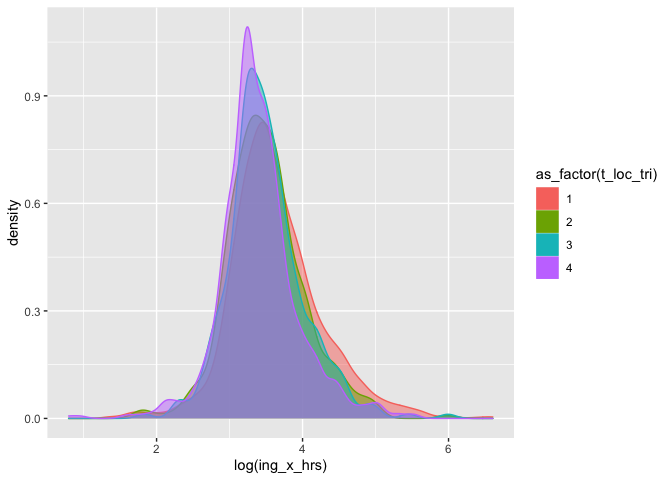
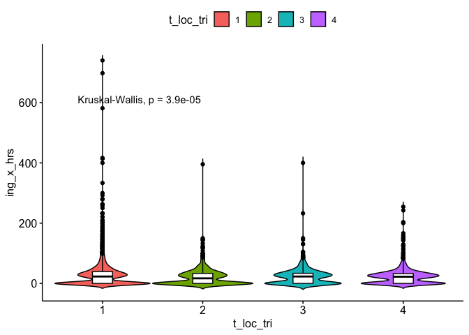
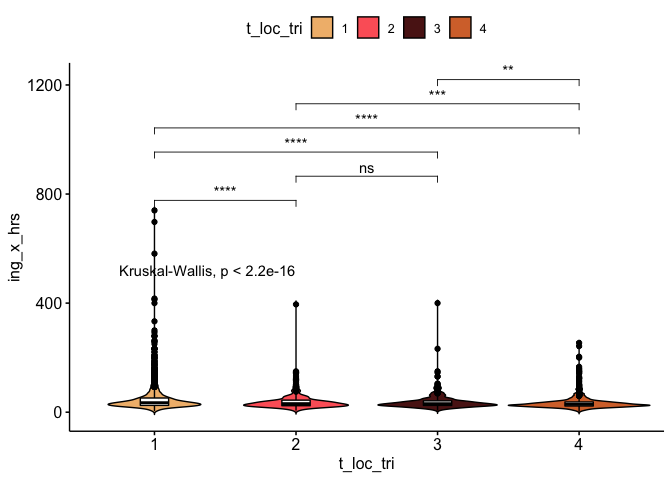
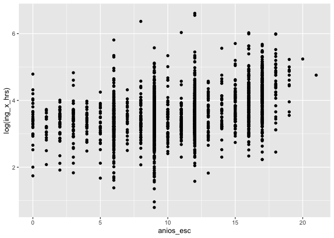
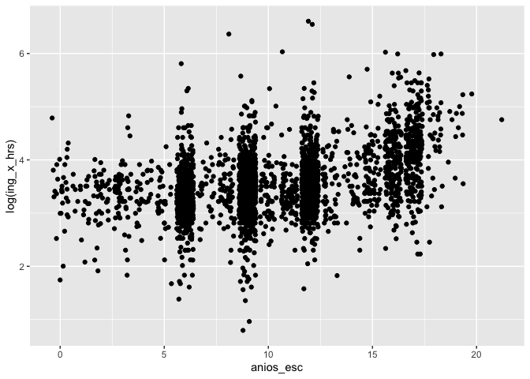
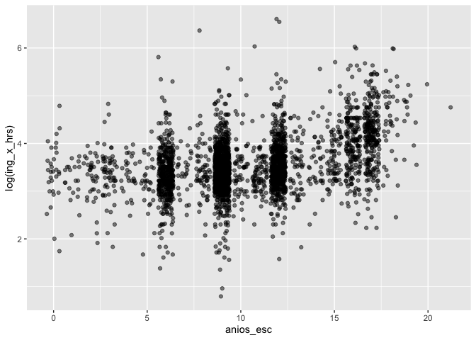
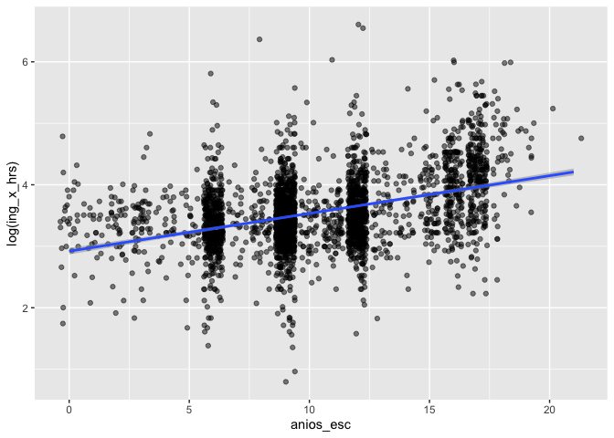

Práctica 3
================
Ana Escoto
1/11/2022

-   [Paquetes](#paquetes)
-   [Cargando los datos](#cargando-los-datos)
-   [Análisis de varianza](#análisis-de-varianza)
    -   [Primero un gráfico](#primero-un-gráfico)
    -   [Supuestos de ANOVA](#supuestos-de-anova)
    -   [Kruskal-Wallis test](#kruskal-wallis-test)
-   [Interludio …](#interludio-)
-   [Factores de expansión](#factores-de-expansión)
    -   [La función tally](#la-función-tally)
    -   [Otras formas](#otras-formas)
-   [Introducción a la regresión
    lineal](#introducción-a-la-regresión-lineal)
    -   [La relación entre dos
        variables](#la-relación-entre-dos-variables)

# Paquetes

``` r
if (!require("pacman")) install.packages("pacman")#instala pacman si se requiere
```

    ## Loading required package: pacman

``` r
pacman::p_load(tidyverse,
               readxl,
               writexl, 
               haven,
               sjlabelled, 
               janitor,
               infer, 
               ggpubr,
               magrittr,
               gt,
               GGally,
               broom,
               DescTools,
               wesanderson,
               gtsummary,
               srvyr,
               car)
```

# Cargando los datos

Desde STATA

``` r
ags_t321 <- read_dta("./datos/AGS_SDEMT321.dta", encoding="latin1") %>% 
  clean_names()
```

Desde Excel:

``` r
ICI_2021 <- read_excel("./datos/ICI_2021.xlsx",
                               sheet = "para_importar") %>% 
  clean_names()
```

    ## New names:
    ## * `` -> ...2

``` r
ags_t321 %<>%
  filter(r_def==0) %>% 
  filter(!c_res==2)
```

# Análisis de varianza

Análisis de varianza. Haremos la versión más simple. Para ver el efecto
de un factor sobre una variable cualitativa (oneway). Revisaremos si la
región de residencia de los trabajadores tiene un efecto en la
distribución de los ingresos por trabajo.

## Primero un gráfico

la ANOVA se basa en que nuestra variable es normal. Quitaremos los
outliers

``` r
lienzo_bi <-ags_t321 %>% 
           filter(clase2==1  & !ing_x_hrs==0) %>% 
           ggplot(aes(x=log(ing_x_hrs), fill=as_factor(t_loc_tri), 
           color=as_factor(t_loc_tri),
           alpha=I(0.5)))

lienzo_bi + geom_density()
```

<!-- -->

La prueba ANOVA o análisis de varianza, nos dice cuánto de nuestra
variable se ve explicado por un factor.

*H*<sub>*o*</sub> : *μ*<sub>1</sub> = *μ*<sub>2</sub> = *μ*<sub>3</sub> = *μ*<sub>4</sub>

*H*<sub>*a*</sub> : Alguna de las medias es diferente

En los modelos es mul útil guardar nuestros resultados como un objeto

``` r
anova<-ags_t321 %>% 
    filter(clase2==1) %>% 
      with(aov(ing_x_hrs ~ as_factor(t_loc_tri)))

summary(anova)
```

    ##                        Df  Sum Sq Mean Sq F value   Pr(>F)    
    ## as_factor(t_loc_tri)    3   53639   17880   12.69 2.92e-08 ***
    ## Residuals            5298 7465357    1409                     
    ## ---
    ## Signif. codes:  0 '***' 0.001 '**' 0.01 '*' 0.05 '.' 0.1 ' ' 1

Con tidy:

``` r
tidy(anova)
```

    ## # A tibble: 2 × 6
    ##   term                    df    sumsq meansq statistic       p.value
    ##   <chr>                <dbl>    <dbl>  <dbl>     <dbl>         <dbl>
    ## 1 as_factor(t_loc_tri)     3   53639. 17880.      12.7  0.0000000292
    ## 2 Residuals             5298 7465357.  1409.      NA   NA

### Comparación entre grupos

¿si es significativo cuáles diferencias entre los grupos lo son?

``` r
TukeyHSD(anova)
```

    ##   Tukey multiple comparisons of means
    ##     95% family-wise confidence level
    ## 
    ## Fit: aov(formula = ing_x_hrs ~ as_factor(t_loc_tri))
    ## 
    ## $`as_factor(t_loc_tri)`
    ##          diff        lwr         upr     p adj
    ## 2-1 -7.882723 -11.838290 -3.92715623 0.0000019
    ## 3-1 -4.684420  -9.325617 -0.04322276 0.0469100
    ## 4-1 -5.716849  -9.073225 -2.36047317 0.0000723
    ## 3-2  3.198304  -2.346313  8.74291975 0.4482453
    ## 4-2  2.165874  -2.358208  6.68995626 0.6075467
    ## 4-3 -1.032429  -6.166776  4.10191736 0.9551079

## Supuestos de ANOVA

-   Las observaciones se obtienen de forma independiente y aleatoria de
    la población definida por los niveles del factor
-   Los datos de cada nivel de factor se distribuyen normalmente.
-   Estas poblaciones normales tienen una varianza común.

``` r
#Prueba Bartlett para ver si las varianzas son iguales

ags_t321 %>% 
    filter(clase2==1) %>% 
      with(bartlett.test(ing_x_hrs ~ as_factor(t_loc_tri)))
```

    ## 
    ##  Bartlett test of homogeneity of variances
    ## 
    ## data:  ing_x_hrs by as_factor(t_loc_tri)
    ## Bartlett's K-squared = 488.77, df = 3, p-value < 2.2e-16

La prueba tiene una Ho “Las varianzas son iguales”

``` r
#Test Normalidad 
ags_t321 %>% 
  filter(clase2==1) %>% 
  filter(ing_x_hrs>0) %>% 
 with(
    ks.test(ing_x_hrs, "pnorm", mean=mean(ing_x_hrs), sd=sd(ing_x_hrs))
    )
```

    ## Warning in ks.test(ing_x_hrs, "pnorm", mean = mean(ing_x_hrs), sd =
    ## sd(ing_x_hrs)): ties should not be present for the Kolmogorov-Smirnov test

    ## 
    ##  One-sample Kolmogorov-Smirnov test
    ## 
    ## data:  ing_x_hrs
    ## D = 0.21965, p-value < 2.2e-16
    ## alternative hypothesis: two-sided

La prueba tiene una Ho “La variable es normal”

**¿Qué hacer?**

## Kruskal-Wallis test

Hay una prueba muy parecida que se basa en el orden de las
observaciones, y se lee muy parecida a la ANOVA

``` r
kruskal<-ags_t321 %>% 
    filter(clase2==1) %>% 
      with(
        kruskal.test(ing_x_hrs ~ as_factor(t_loc_tri))
        )

kruskal
```

    ## 
    ##  Kruskal-Wallis rank sum test
    ## 
    ## data:  ing_x_hrs by as_factor(t_loc_tri)
    ## Kruskal-Wallis chi-squared = 23.059, df = 3, p-value = 3.926e-05

Para ver las comparaciones tenemos que usar el DunnTest(), del paquete
DescTools

``` r
ags_t321 %>% 
    filter(clase2==1) %>% 
      with(
        DescTools::DunnTest(ing_x_hrs ~ as_factor(t_loc_tri))
        )
```

    ## 
    ##  Dunn's test of multiple comparisons using rank sums : holm  
    ## 
    ##     mean.rank.diff    pval    
    ## 2-1     -286.75276 1.4e-05 ***
    ## 3-1      -79.64996  0.5285    
    ## 4-1     -103.76924  0.1329    
    ## 3-2      207.10280  0.0604 .  
    ## 4-2      182.98351  0.0425 *  
    ## 4-3      -24.11929  0.7599    
    ## ---
    ## Signif. codes:  0 '***' 0.001 '**' 0.01 '*' 0.05 '.' 0.1 ' ' 1

### Un gráfico coqueto:

``` r
ags_t321 %>% 
  filter(clase2==1) %>% 
  ggpubr::ggviolin(x = "t_loc_tri", y = "ing_x_hrs", fill = "t_loc_tri",
                   add = "boxplot", add.params = list(fill = "white")) +
  stat_compare_means(label.y = 600)  # Add the p-value 
```

<!-- -->

``` r
comparaciones <- list( c("1", "2"), c("2", "3"), c("1", "3"),
                       c("1", "4"), c("2", "4"), c("3", "4") )


#Un gráfiquito accesorio 2:

ags_t321 %>% 
  filter(clase2==1) %>% 
  filter(ing_x_hrs>0) %>% 
  ggpubr::ggviolin(x = "t_loc_tri", y = "ing_x_hrs", fill = "t_loc_tri",
                   palette = wesanderson::wes_palette("GrandBudapest1", 4, type="discrete"),
                   add = "boxplot", add.params = list(fill = "white"))+
  stat_compare_means(comparisons = comparaciones, label = "p.signif")+ # Add significance levels
  stat_compare_means(label.y = 500)     # Add global the p-value 
```

<!-- -->

# Interludio …

# Factores de expansión

## La función tally

El comando “tabyl()” del paquete “janitor” es muy útil pero no es
compatible con los factores del expansión. En realidad, tabyl() nos
ahorra un poco el hecho de tener que agrupar nuestra base en categorías
y luego hacer un conteo para cada una de ellas. “tally()” es un comando
que nos hace ese conteo y “group\_by” nos agrupa las observaciones de
nuestra base de datos para hacer cualquier operación.

``` r
ags_t321 %>% 
 group_by(as_label(sex)) %>% 
  tally(fac_tri) %>% #nombre del factor
  adorn_totals()  # Agrega total
```

    ##  as_label(sex)       n
    ##         Hombre  703429
    ##          Mujer  755975
    ##          Total 1459404

Podemos usar funciones de tabyl

``` r
ags_t321 %>% 
 group_by(as_label(sex)) %>% 
  tally(fac_tri) %>% #nombre del factor
  adorn_totals() %>% # Agrega total
  adorn_percentages("all")  %>% 
  adorn_pct_formatting()
```

    ##  as_label(sex)      n
    ##         Hombre  48.2%
    ##          Mujer  51.8%
    ##          Total 100.0%

## Otras formas

La función “count()” también permite dar pesos

``` r
ags_t321 %>% 
  count(sex, niv_ins,  wt = fac_tri) 
```

    ## # A tibble: 12 × 3
    ##           sex                       niv_ins      n
    ##     <dbl+lbl>                     <dbl+lbl>  <dbl>
    ##  1 1 [Hombre] 0 [No aplica]                  52383
    ##  2 1 [Hombre] 1 [Primaria incompleta]       140206
    ##  3 1 [Hombre] 2 [Prrimaria completa]        119581
    ##  4 1 [Hombre] 3 [Secundaria completa]       173654
    ##  5 1 [Hombre] 4 [Medio superior y superior] 217116
    ##  6 1 [Hombre] 5 [No especificado]              489
    ##  7 2 [Mujer]  0 [No aplica]                  51247
    ##  8 2 [Mujer]  1 [Primaria incompleta]       143290
    ##  9 2 [Mujer]  2 [Prrimaria completa]        134973
    ## 10 2 [Mujer]  3 [Secundaria completa]       214571
    ## 11 2 [Mujer]  4 [Medio superior y superior] 211141
    ## 12 2 [Mujer]  5 [No especificado]              753

Es compatible con etiquetas

``` r
ags_t321 %>% 
  count(as_label(sex), as_label(niv_ins),  wt = fac_tri) 
```

    ## # A tibble: 12 × 3
    ##    `as_label(sex)` `as_label(niv_ins)`            n
    ##    <fct>           <fct>                      <dbl>
    ##  1 Hombre          No aplica                  52383
    ##  2 Hombre          Primaria incompleta       140206
    ##  3 Hombre          Prrimaria completa        119581
    ##  4 Hombre          Secundaria completa       173654
    ##  5 Hombre          Medio superior y superior 217116
    ##  6 Hombre          No especificado              489
    ##  7 Mujer           No aplica                  51247
    ##  8 Mujer           Primaria incompleta       143290
    ##  9 Mujer           Prrimaria completa        134973
    ## 10 Mujer           Secundaria completa       214571
    ## 11 Mujer           Medio superior y superior 211141
    ## 12 Mujer           No especificado              753

Podemos mover un poquito con pivot\_wider para que se vea más a lo que
acostumbramos a una tabla de frecuencias

``` r
ags_t321 %>% 
  mutate_at(vars(sex, niv_ins), as_label) %>% 
  count(sex, niv_ins,  wt = fac_tri) %>% 
  tidyr::pivot_wider(names_from = sex, 
              values_from = n)
```

    ## # A tibble: 6 × 3
    ##   niv_ins                   Hombre  Mujer
    ##   <fct>                      <dbl>  <dbl>
    ## 1 No aplica                  52383  51247
    ## 2 Primaria incompleta       140206 143290
    ## 3 Prrimaria completa        119581 134973
    ## 4 Secundaria completa       173654 214571
    ## 5 Medio superior y superior 217116 211141
    ## 6 No especificado              489    753

``` r
ags_t321 %>% 
  mutate_at(vars(sex, niv_ins), as_label) %>% # otra forma de mutate y as_label
  count(sex, niv_ins,  wt = fac_tri) %>% 
  pivot_wider(names_from = sex, 
              values_from = n) %>%
  adorn_totals() %>% # Agrega total
  adorn_percentages("col")  %>% 
  adorn_pct_formatting()
```

    ##                    niv_ins Hombre  Mujer
    ##                  No aplica   7.4%   6.8%
    ##        Primaria incompleta  19.9%  19.0%
    ##         Prrimaria completa  17.0%  17.9%
    ##        Secundaria completa  24.7%  28.4%
    ##  Medio superior y superior  30.9%  27.9%
    ##            No especificado   0.1%   0.1%
    ##                      Total 100.0% 100.0%

\#Diseño complejo

Hay muchos diseños muestrales, asumiremos el diseño simple, pero hay que
revisar la documentación de la base

``` r
# Muestreo aleatorio
ags_srvy <- ags_t321 %>%
  as_survey_design(weights = fac_tri)
```

Si revisamos las encuestas tiene un diseño complejo, hay estratos y
unidades primarias de muestreo

``` r
# Muestreo estratificado
ags_srvy <- ags_t321 %>%
  as_survey_design(
    upm,
    strata = est_d_tri,
    weights = fac_tri,
    nest = TRUE)
```

Como vemos esto es un archivo bien grande, por lo que mejor vamos a
seleccionar un par de variables:

``` r
# simple random sample
ags_srvy <- ags_t321 %>%
  select(upm,est_d_tri, fac_tri, starts_with("clase"),
         sex, eda, anios_esc, ing_x_hrs, fac_tri) %>% 
  as_survey_design(
    upm,
    strata = est_d_tri,
    weights = fac_tri,
    nest = TRUE)
```

Para una media ponderada

``` r
ags_srvy %>%
  filter(eda>14 & eda<99) %>% #filtro de edad para tabulados
  filter(clase2==1) %>% # sólo ocupados
  filter(ing_x_hrs>0) %>% # sólo con ingresos
  summarise(
    media_ponderada = survey_mean(ing_x_hrs, na.rm=T))
```

    ##   media_ponderada media_ponderada_se
    ## 1        44.09341           1.030019

Este valor coincide con los datos publicados por INEGI, incluso el error
estándar. Si queremos los intervalos de confianza:

``` r
ags_srvy %>%
  filter(eda>14 & eda<99) %>% #filtro de edad para tabulados
  filter(clase2==1) %>% # sólo ocupados
  filter(ing_x_hrs>0) %>% # sólo con ingresos
  summarize(
    media_ponderada = survey_mean(ing_x_hrs,
                                  vartype = "ci") )
```

    ##   media_ponderada media_ponderada_low media_ponderada_upp
    ## 1        44.09341            42.06873            46.11808

``` r
ags_srvy %>%
  filter(eda>14 & eda<99) %>% #filtro de edad para tabulados
  filter(clase2==1) %>% # sólo ocupados
  filter(ing_x_hrs>0) %>% # sólo con ingresos
  summarize(
    mediana_ponderada = survey_median(ing_x_hrs,
                                  vartype = "ci") )
```

    ##   mediana_ponderada mediana_ponderada_low mediana_ponderada_upp
    ## 1          33.33333              32.55814              33.33333

``` r
ags_srvy %>%
  mutate(sex=as_label(sex)) %>% 
  group_by(sex) %>% #variables cuali
  summarize(proportion = survey_mean(), # proporción
            total = survey_total() ) # totales
```

    ## # A tibble: 2 × 5
    ##   sex    proportion proportion_se  total total_se
    ##   <fct>       <dbl>         <dbl>  <dbl>    <dbl>
    ## 1 Hombre      0.482       0.00379 703429   10368.
    ## 2 Mujer       0.518       0.00379 755975   10908.

# Introducción a la regresión lineal

## La relación entre dos variables

En términos *mincerianos*, los ingresos estarían explicados por la
escolaridad y la experiencia…

``` r
ags_t321 %>% 
  filter(clase2==1) %>% 
  filter(ing_x_hrs>0) %>% 
  filter(anios_esc<99) %>% 
  ggplot() +
    aes(x=anios_esc, y=log(ing_x_hrs)) + 
  geom_point()
```

<!-- -->

Cuando tenemos muchos casos es útil la opción “jitter”

``` r
ags_t321 %>% 
  filter(clase2==1) %>% 
  filter(ing_x_hrs>0) %>% 
  filter(anios_esc<99) %>% 
  ggplot() +
    aes(x=anios_esc, y=log(ing_x_hrs)) + 
  geom_jitter()
```

<!-- --> También cambiar
un poquito la transparencia…

``` r
ags_t321 %>% 
  filter(clase2==1) %>% 
  filter(ing_x_hrs>0) %>% 
  filter(anios_esc<99) %>% 
  ggplot() +
    aes(x=anios_esc, y=log(ing_x_hrs), alpha=I(0.5)) + 
  geom_jitter()
```

<!-- -->

¿Cómo se ve la línea MCO ajustada por estos elementos?

``` r
ags_t321 %>% 
  filter(clase2==1) %>% 
  filter(ing_x_hrs>0) %>% 
  filter(anios_esc<99) %>% 
  ggplot() +
    aes(x=anios_esc, y=log(ing_x_hrs), alpha=I(0.5)) + 
  geom_jitter()+
  geom_smooth(method = lm)
```

    ## `geom_smooth()` using formula 'y ~ x'

<!-- -->

¿cómo se ajusta esa línea?

``` r
model<-ags_t321 %>% 
  filter(clase2==1) %>% 
  filter(ing_x_hrs>0) %>% 
  filter(anios_esc<99) %>% 
  with(
    lm(log(ing_x_hrs)~ anios_esc)
  )

model
```

    ## 
    ## Call:
    ## lm(formula = log(ing_x_hrs) ~ anios_esc)
    ## 
    ## Coefficients:
    ## (Intercept)    anios_esc  
    ##     2.92032      0.06136

Guardarlo en un objeto sirve de mucho porque le podemos “preguntar”
cosas

``` r
summary(model) # da todo menos la anova de la regresión
```

    ## 
    ## Call:
    ## lm(formula = log(ing_x_hrs) ~ anios_esc)
    ## 
    ## Residuals:
    ##     Min      1Q  Median      3Q     Max 
    ## -2.6773 -0.3277 -0.0305  0.2966  2.9543 
    ## 
    ## Coefficients:
    ##             Estimate Std. Error t value Pr(>|t|)    
    ## (Intercept) 2.920324   0.027155  107.54   <2e-16 ***
    ## anios_esc   0.061355   0.002476   24.79   <2e-16 ***
    ## ---
    ## Signif. codes:  0 '***' 0.001 '**' 0.01 '*' 0.05 '.' 0.1 ' ' 1
    ## 
    ## Residual standard error: 0.5438 on 3205 degrees of freedom
    ## Multiple R-squared:  0.1608, Adjusted R-squared:  0.1606 
    ## F-statistic: 614.3 on 1 and 3205 DF,  p-value: < 2.2e-16

``` r
confint(model) # da los intervalos de confianza
```

    ##                  2.5 %     97.5 %
    ## (Intercept) 2.86708152 2.97356747
    ## anios_esc   0.05650163 0.06620911

``` r
anova(model) # esto sí da la anova de la regresión.
```

    ## Analysis of Variance Table
    ## 
    ## Response: log(ing_x_hrs)
    ##             Df Sum Sq Mean Sq F value    Pr(>F)    
    ## anios_esc    1 181.67 181.667  614.29 < 2.2e-16 ***
    ## Residuals 3205 947.82   0.296                      
    ## ---
    ## Signif. codes:  0 '***' 0.001 '**' 0.01 '*' 0.05 '.' 0.1 ' ' 1

Para ver esto más guapo:

``` r
model %>%
   gtsummary::tbl_regression() 
```

<div id="rvketnvyze" style="overflow-x:auto;overflow-y:auto;width:auto;height:auto;">
<style>html {
  font-family: -apple-system, BlinkMacSystemFont, 'Segoe UI', Roboto, Oxygen, Ubuntu, Cantarell, 'Helvetica Neue', 'Fira Sans', 'Droid Sans', Arial, sans-serif;
}

#rvketnvyze .gt_table {
  display: table;
  border-collapse: collapse;
  margin-left: auto;
  margin-right: auto;
  color: #333333;
  font-size: 16px;
  font-weight: normal;
  font-style: normal;
  background-color: #FFFFFF;
  width: auto;
  border-top-style: solid;
  border-top-width: 2px;
  border-top-color: #A8A8A8;
  border-right-style: none;
  border-right-width: 2px;
  border-right-color: #D3D3D3;
  border-bottom-style: solid;
  border-bottom-width: 2px;
  border-bottom-color: #A8A8A8;
  border-left-style: none;
  border-left-width: 2px;
  border-left-color: #D3D3D3;
}

#rvketnvyze .gt_heading {
  background-color: #FFFFFF;
  text-align: center;
  border-bottom-color: #FFFFFF;
  border-left-style: none;
  border-left-width: 1px;
  border-left-color: #D3D3D3;
  border-right-style: none;
  border-right-width: 1px;
  border-right-color: #D3D3D3;
}

#rvketnvyze .gt_title {
  color: #333333;
  font-size: 125%;
  font-weight: initial;
  padding-top: 4px;
  padding-bottom: 4px;
  border-bottom-color: #FFFFFF;
  border-bottom-width: 0;
}

#rvketnvyze .gt_subtitle {
  color: #333333;
  font-size: 85%;
  font-weight: initial;
  padding-top: 0;
  padding-bottom: 6px;
  border-top-color: #FFFFFF;
  border-top-width: 0;
}

#rvketnvyze .gt_bottom_border {
  border-bottom-style: solid;
  border-bottom-width: 2px;
  border-bottom-color: #D3D3D3;
}

#rvketnvyze .gt_col_headings {
  border-top-style: solid;
  border-top-width: 2px;
  border-top-color: #D3D3D3;
  border-bottom-style: solid;
  border-bottom-width: 2px;
  border-bottom-color: #D3D3D3;
  border-left-style: none;
  border-left-width: 1px;
  border-left-color: #D3D3D3;
  border-right-style: none;
  border-right-width: 1px;
  border-right-color: #D3D3D3;
}

#rvketnvyze .gt_col_heading {
  color: #333333;
  background-color: #FFFFFF;
  font-size: 100%;
  font-weight: normal;
  text-transform: inherit;
  border-left-style: none;
  border-left-width: 1px;
  border-left-color: #D3D3D3;
  border-right-style: none;
  border-right-width: 1px;
  border-right-color: #D3D3D3;
  vertical-align: bottom;
  padding-top: 5px;
  padding-bottom: 6px;
  padding-left: 5px;
  padding-right: 5px;
  overflow-x: hidden;
}

#rvketnvyze .gt_column_spanner_outer {
  color: #333333;
  background-color: #FFFFFF;
  font-size: 100%;
  font-weight: normal;
  text-transform: inherit;
  padding-top: 0;
  padding-bottom: 0;
  padding-left: 4px;
  padding-right: 4px;
}

#rvketnvyze .gt_column_spanner_outer:first-child {
  padding-left: 0;
}

#rvketnvyze .gt_column_spanner_outer:last-child {
  padding-right: 0;
}

#rvketnvyze .gt_column_spanner {
  border-bottom-style: solid;
  border-bottom-width: 2px;
  border-bottom-color: #D3D3D3;
  vertical-align: bottom;
  padding-top: 5px;
  padding-bottom: 5px;
  overflow-x: hidden;
  display: inline-block;
  width: 100%;
}

#rvketnvyze .gt_group_heading {
  padding: 8px;
  color: #333333;
  background-color: #FFFFFF;
  font-size: 100%;
  font-weight: initial;
  text-transform: inherit;
  border-top-style: solid;
  border-top-width: 2px;
  border-top-color: #D3D3D3;
  border-bottom-style: solid;
  border-bottom-width: 2px;
  border-bottom-color: #D3D3D3;
  border-left-style: none;
  border-left-width: 1px;
  border-left-color: #D3D3D3;
  border-right-style: none;
  border-right-width: 1px;
  border-right-color: #D3D3D3;
  vertical-align: middle;
}

#rvketnvyze .gt_empty_group_heading {
  padding: 0.5px;
  color: #333333;
  background-color: #FFFFFF;
  font-size: 100%;
  font-weight: initial;
  border-top-style: solid;
  border-top-width: 2px;
  border-top-color: #D3D3D3;
  border-bottom-style: solid;
  border-bottom-width: 2px;
  border-bottom-color: #D3D3D3;
  vertical-align: middle;
}

#rvketnvyze .gt_from_md > :first-child {
  margin-top: 0;
}

#rvketnvyze .gt_from_md > :last-child {
  margin-bottom: 0;
}

#rvketnvyze .gt_row {
  padding-top: 8px;
  padding-bottom: 8px;
  padding-left: 5px;
  padding-right: 5px;
  margin: 10px;
  border-top-style: solid;
  border-top-width: 1px;
  border-top-color: #D3D3D3;
  border-left-style: none;
  border-left-width: 1px;
  border-left-color: #D3D3D3;
  border-right-style: none;
  border-right-width: 1px;
  border-right-color: #D3D3D3;
  vertical-align: middle;
  overflow-x: hidden;
}

#rvketnvyze .gt_stub {
  color: #333333;
  background-color: #FFFFFF;
  font-size: 100%;
  font-weight: initial;
  text-transform: inherit;
  border-right-style: solid;
  border-right-width: 2px;
  border-right-color: #D3D3D3;
  padding-left: 12px;
}

#rvketnvyze .gt_summary_row {
  color: #333333;
  background-color: #FFFFFF;
  text-transform: inherit;
  padding-top: 8px;
  padding-bottom: 8px;
  padding-left: 5px;
  padding-right: 5px;
}

#rvketnvyze .gt_first_summary_row {
  padding-top: 8px;
  padding-bottom: 8px;
  padding-left: 5px;
  padding-right: 5px;
  border-top-style: solid;
  border-top-width: 2px;
  border-top-color: #D3D3D3;
}

#rvketnvyze .gt_grand_summary_row {
  color: #333333;
  background-color: #FFFFFF;
  text-transform: inherit;
  padding-top: 8px;
  padding-bottom: 8px;
  padding-left: 5px;
  padding-right: 5px;
}

#rvketnvyze .gt_first_grand_summary_row {
  padding-top: 8px;
  padding-bottom: 8px;
  padding-left: 5px;
  padding-right: 5px;
  border-top-style: double;
  border-top-width: 6px;
  border-top-color: #D3D3D3;
}

#rvketnvyze .gt_striped {
  background-color: rgba(128, 128, 128, 0.05);
}

#rvketnvyze .gt_table_body {
  border-top-style: solid;
  border-top-width: 2px;
  border-top-color: #D3D3D3;
  border-bottom-style: solid;
  border-bottom-width: 2px;
  border-bottom-color: #D3D3D3;
}

#rvketnvyze .gt_footnotes {
  color: #333333;
  background-color: #FFFFFF;
  border-bottom-style: none;
  border-bottom-width: 2px;
  border-bottom-color: #D3D3D3;
  border-left-style: none;
  border-left-width: 2px;
  border-left-color: #D3D3D3;
  border-right-style: none;
  border-right-width: 2px;
  border-right-color: #D3D3D3;
}

#rvketnvyze .gt_footnote {
  margin: 0px;
  font-size: 90%;
  padding: 4px;
}

#rvketnvyze .gt_sourcenotes {
  color: #333333;
  background-color: #FFFFFF;
  border-bottom-style: none;
  border-bottom-width: 2px;
  border-bottom-color: #D3D3D3;
  border-left-style: none;
  border-left-width: 2px;
  border-left-color: #D3D3D3;
  border-right-style: none;
  border-right-width: 2px;
  border-right-color: #D3D3D3;
}

#rvketnvyze .gt_sourcenote {
  font-size: 90%;
  padding: 4px;
}

#rvketnvyze .gt_left {
  text-align: left;
}

#rvketnvyze .gt_center {
  text-align: center;
}

#rvketnvyze .gt_right {
  text-align: right;
  font-variant-numeric: tabular-nums;
}

#rvketnvyze .gt_font_normal {
  font-weight: normal;
}

#rvketnvyze .gt_font_bold {
  font-weight: bold;
}

#rvketnvyze .gt_font_italic {
  font-style: italic;
}

#rvketnvyze .gt_super {
  font-size: 65%;
}

#rvketnvyze .gt_footnote_marks {
  font-style: italic;
  font-weight: normal;
  font-size: 65%;
}
</style>
<table class="gt_table">
  
  <thead class="gt_col_headings">
    <tr>
      <th class="gt_col_heading gt_columns_bottom_border gt_left" rowspan="1" colspan="1"><strong>Characteristic</strong></th>
      <th class="gt_col_heading gt_columns_bottom_border gt_center" rowspan="1" colspan="1"><strong>Beta</strong></th>
      <th class="gt_col_heading gt_columns_bottom_border gt_center" rowspan="1" colspan="1"><strong>95% CI</strong><sup class="gt_footnote_marks">1</sup></th>
      <th class="gt_col_heading gt_columns_bottom_border gt_center" rowspan="1" colspan="1"><strong>p-value</strong></th>
    </tr>
  </thead>
  <tbody class="gt_table_body">
    <tr><td class="gt_row gt_left">Años de escolaridad</td>
<td class="gt_row gt_center">0.06</td>
<td class="gt_row gt_center">0.06, 0.07</td>
<td class="gt_row gt_center"><0.001</td></tr>
  </tbody>
  
  <tfoot>
    <tr class="gt_footnotes">
      <td colspan="4">
        <p class="gt_footnote">
          <sup class="gt_footnote_marks">
            <em>1</em>
          </sup>
           
          CI = Confidence Interval
          <br />
        </p>
      </td>
    </tr>
  </tfoot>
</table>
</div>

``` r
  #%>% 
  # add_significance_stars() %>% 
  # add_n() %>% 
  # add_glance_table()
```
