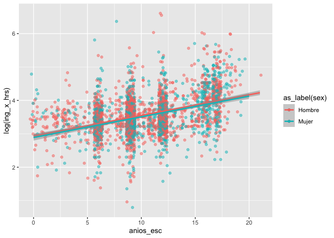
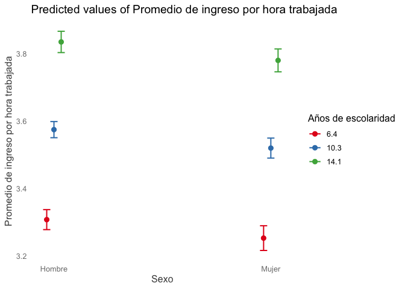

Práctica 4
================
Ana Escoto
23/06/2022

-   [Paquetes](#paquetes)
-   [Cargando los datos](#cargando-los-datos)
-   [Prueba de hipótesis para la
    correlación](#prueba-de-hipótesis-para-la-correlación)
-   [Modelo simple](#modelo-simple)
-   [Diagnósticos](#diagnósticos)
-   [Regresión Lineal múltiple](#regresión-lineal-múltiple)
    -   [Agregando una variable
        categórica](#agregando-una-variable-categórica)
    -   [Otros supuestos](#otros-supuestos)
    -   [Jtools](#jtools)
-   [Post-estimación](#post-estimación)
    -   [Las predicciones](#las-predicciones)
    -   [Efectos marginales](#efectos-marginales)
-   [Extensiones del modelo de
    regresión](#extensiones-del-modelo-de-regresión)
    -   [Introducción a las
        interacciones](#introducción-a-las-interacciones)
    -   [Efectos no lineales](#efectos-no-lineales)

# Paquetes

``` r
if (!require("pacman")) install.packages("pacman")#instala pacman si se requiere
```

    ## Loading required package: pacman

``` r
pacman::p_load(tidyverse,
               readxl,
               writexl, 
               haven,
               sjlabelled, 
               janitor,
               infer, 
               ggpubr,
               magrittr,
               gt,
               GGally,
               broom,
               DescTools,
               wesanderson,
               gtsummary,
               srvyr,
               car,
               sjPlot,
               jtools,
               sandwich, huxtable)
```

# Cargando los datos

``` r
ags_t321 <- read_dta("./datos/AGS_SDEMT321.dta", encoding="latin1") %>% 
  clean_names()
```

Hoy sí filtraremos toda nuestra base para quedarnos sólo con algunas
variables y casos

``` r
ags_t321 %<>%
  filter(r_def==0) %>% 
  filter(!c_res==2) %>% 
  filter(ing_x_hrs>0) %>% 
  filter(clase2==1) %>% 
  filter(anios_esc<99)
```

# Prueba de hipótesis para la correlación

Una prueba de hipotésis sobe la correlación

``` r
cor_test<-ags_t321 %>% 
    with(
      cor.test(ing_x_hrs, 
               anios_esc, 
               use = "pairwise")) # prueba de hipótesis.

#dos modos de visualizar el resultado
cor_test 
```

    ## 
    ##  Pearson's product-moment correlation
    ## 
    ## data:  ing_x_hrs and anios_esc
    ## t = 19.855, df = 3205, p-value < 2.2e-16
    ## alternative hypothesis: true correlation is not equal to 0
    ## 95 percent confidence interval:
    ##  0.2997756 0.3614258
    ## sample estimates:
    ##       cor 
    ## 0.3309538

``` r
tidy(cor_test)
```

    ## Warning in knit_print.huxtable(ht): Unrecognized output format "gfm-yaml". Using `to_screen` to print huxtables.
    ## Set options("huxtable.knitr_output_format") manually to "latex", "html", "rtf", "docx", "pptx", "md" or "screen".

┌─────────────────────────────────────────────────────────────────────────────
│ estimate statisti p.value paramete conf.low conf.hig method  
│ c r h  
├─────────────────────────────────────────────────────────────────────────────
│ 0.331 19.9 7.81e-83 3205 0.3 0.361 Pearson’  
│ s  
│ product-  
│ moment  
│ correlat  
│ ion  
└─────────────────────────────────────────────────────────────────────────────

Column names: estimate, statistic, p.value, parameter, conf.low,
conf.high, method, alternative

7/8 columns shown.

# Modelo simple


Donde los parámetros

y

describen la pendiente y el intercepto de la población, respectivamente.

No está muy bien comportada, pero ligeramente es mejor con logaritmo

``` r
ags_t321 %<>% 
  mutate(log_ing_x_hrs=log(ing_x_hrs))
```

Una vez transformada nuestra variable, corremos el modelo

``` r
modelo <- ags_t321 %>% 
  with(lm(log_ing_x_hrs~anios_esc))

  summary(modelo) # resultado forma1
```

    ## 
    ## Call:
    ## lm(formula = log_ing_x_hrs ~ anios_esc)
    ## 
    ## Residuals:
    ##     Min      1Q  Median      3Q     Max 
    ## -2.6773 -0.3277 -0.0305  0.2966  2.9543 
    ## 
    ## Coefficients:
    ##             Estimate Std. Error t value Pr(>|t|)    
    ## (Intercept) 2.920324   0.027155  107.54   <2e-16 ***
    ## anios_esc   0.061355   0.002476   24.79   <2e-16 ***
    ## ---
    ## Signif. codes:  0 '***' 0.001 '**' 0.01 '*' 0.05 '.' 0.1 ' ' 1
    ## 
    ## Residual standard error: 0.5438 on 3205 degrees of freedom
    ## Multiple R-squared:  0.1608, Adjusted R-squared:  0.1606 
    ## F-statistic: 614.3 on 1 and 3205 DF,  p-value: < 2.2e-16

Con “tidy()”

``` r
tidy(modelo) # Pruebas de hipótesis de los coeficientes
```

    ## Warning in knit_print.huxtable(ht): Unrecognized output format "gfm-yaml". Using `to_screen` to print huxtables.
    ## Set options("huxtable.knitr_output_format") manually to "latex", "html", "rtf", "docx", "pptx", "md" or "screen".

         ┌────────────────────────────────────────────────────────────┐
         │ term          estimate   std.error   statistic     p.value │
         ├────────────────────────────────────────────────────────────┤
         │ (Intercept)     2.92       0.0272        108     0         │
         │ anios_esc       0.0614     0.00248        24.8   3.21e-124 │
         └────────────────────────────────────────────────────────────┘

Column names: term, estimate, std.error, statistic, p.value

Para obtener los intervalos de confianza, podemos hacerlo a partir del
siguiente comando:

``` r
confint(modelo)
```

    ##                  2.5 %     97.5 %
    ## (Intercept) 2.86708152 2.97356747
    ## anios_esc   0.05650163 0.06620911

Para el ajuste global del modelo, podemos utilzar el comando “glance()”
sobre el objeto de nuestro modelo, ello nos dará la información
correspondiente:

``` r
glance(modelo) # resultado ajuste global
```

    ## Warning in knit_print.huxtable(ht): Unrecognized output format "gfm-yaml". Using `to_screen` to print huxtables.
    ## Set options("huxtable.knitr_output_format") manually to "latex", "html", "rtf", "docx", "pptx", "md" or "screen".

     ┌────────────────────────────────────────────────────────────────────
     │ r.square   adj.r.sq   sigma   statisti    p.value   df     logLik  
     │        d      uared                  c                             
     ├────────────────────────────────────────────────────────────────────
     │    0.161      0.161   0.544        614   3.21e-12    1   -2.6e+03  
     │                                                 4                  
     └────────────────────────────────────────────────────────────────────

Column names: r.squared, adj.r.squared, sigma, statistic, p.value, df,
logLik, AIC, BIC, deviance, df.residual, nobs

7/12 columns shown. Otra manera de ver este ajuste es con el comando
“anova()”:

``` r
anova(modelo)
```

    ## Warning in knit_print.huxtable(ht): Unrecognized output format "gfm-yaml". Using `to_screen` to print huxtables.
    ## Set options("huxtable.knitr_output_format") manually to "latex", "html", "rtf", "docx", "pptx", "md" or "screen".

               ┌───────────────────────────────────────────────┐
               │   Df   Sum Sq   Mean Sq   F value      Pr(>F) │
               ├───────────────────────────────────────────────┤
               │    1      182   182           614   3.21e-124 │
               │ 3205      948     0.296                       │
               └───────────────────────────────────────────────┘

Column names: Df, Sum Sq, Mean Sq, F value, Pr(\>F)

# Diagnósticos

``` r
plot(modelo)
```

<!-- --><!-- --><!-- --><!-- -->

\##1. Outliers y Normalidad

``` r
# Assessing Outliers
car::outlierTest(modelo) # Bonferonni p-value for most extreme obs
```

    ##       rstudent unadjusted p-value Bonferroni p
    ## 1368  5.457985         5.1824e-08   0.00016620
    ## 1384  5.450004         5.4182e-08   0.00017376
    ## 2121  5.340243         9.9300e-08   0.00031845
    ## 236  -4.942090         8.1256e-07   0.00260590
    ## 2781  4.651710         3.4252e-06   0.01098500
    ## 1987 -4.630520         3.7925e-06   0.01216300
    ## 2853  4.495555         7.1848e-06   0.02304200

``` r
ggpubr::ggqqplot(ags_t321$log_ing_x_hrs)
```

<!-- -->

\##2. Homocedasticidad

``` r
# non-constant error variance test
car::ncvTest(modelo)
```

    ## Non-constant Variance Score Test 
    ## Variance formula: ~ fitted.values 
    ## Chisquare = 41.14906, Df = 1, p = 1.4105e-10

``` r
# plot studentized residuals vs. fitted values 
car::spreadLevelPlot(modelo)
```

<!-- -->

    ## 
    ## Suggested power transformation:  -0.793166

# Regresión Lineal múltiple

## Agregando una variable categórica

¿Es igual la relación entre hombres y mujeres con los ingresos y la
escolaridad?

``` r
ags_t321 %>% 
  ggplot() +
    aes(x=anios_esc, y=log(ing_x_hrs), alpha=I(0.5), color=as_label(sex)) + 
  geom_jitter()+
  geom_smooth(method = lm)
```

    ## `geom_smooth()` using formula 'y ~ x'

<!-- -->

Cuando nosotros tenemos una variable categórica para la condición de
sexo. \[nota: seguimos haciendo el ejercicio, a pesar de que ya
observamos en nuestro diagnóstico el modelo no cumple con los supuestos,
pero lo haremos para fines ilustrativos\]

``` r
modelo1<-ags_t321 %>% 
  mutate(sex=as_label(sex)) %>% 
  with(
    lm(log_ing_x_hrs ~anios_esc + sex)
  )

summary(modelo1)
```

    ## 
    ## Call:
    ## lm(formula = log_ing_x_hrs ~ anios_esc + sex)
    ## 
    ## Residuals:
    ##      Min       1Q   Median       3Q      Max 
    ## -2.65148 -0.32711 -0.02543  0.29691  2.98062 
    ## 
    ## Coefficients:
    ##              Estimate Std. Error t value Pr(>|t|)    
    ## (Intercept)  2.931726   0.027671 105.951   <2e-16 ***
    ## anios_esc    0.061849   0.002485  24.887   <2e-16 ***
    ## sexMujer    -0.041708   0.019722  -2.115   0.0345 *  
    ## ---
    ## Signif. codes:  0 '***' 0.001 '**' 0.01 '*' 0.05 '.' 0.1 ' ' 1
    ## 
    ## Residual standard error: 0.5435 on 3204 degrees of freedom
    ## Multiple R-squared:  0.162,  Adjusted R-squared:  0.1615 
    ## F-statistic: 309.7 on 2 and 3204 DF,  p-value: < 2.2e-16

Este modelo tiene coeficientes que deben leerse “condicionados”. Es
decir, en este caso tenemos que el coeficiente asociado a la edad,
mantiene constante el valor de sexo y viceversa.

¿Cómo saber is ha mejorado nuestro modelo? Podemos comparar el ajuste
con la anova, es decir, una prueba F

``` r
pruebaf0<-anova(modelo, modelo1)
pruebaf0
```

    ## Warning in knit_print.huxtable(ht): Unrecognized output format "gfm-yaml". Using `to_screen` to print huxtables.
    ## Set options("huxtable.knitr_output_format") manually to "latex", "html", "rtf", "docx", "pptx", "md" or "screen".

              ┌──────────────────────────────────────────────────┐
              │   Res.Df   RSS    Df   Sum of Sq      F   Pr(>F) │
              ├──────────────────────────────────────────────────┤
              │ 3.20e+03   948                                   │
              │ 3.2e+03    947     1        1.32   4.47   0.0345 │
              └──────────────────────────────────────────────────┘

Column names: Res.Df, RSS, Df, Sum of Sq, F, Pr(\>F)

Como puedes ver, el resultado muestra un Df de 1 (lo que indica que el
modelo más complejo tiene un parámetro adicional) y un valor p muy
pequeño (\<.51). Esto significa que agregar el sexo al modelo lleva a un
ajuste significativamente mejor sobre el modelo original.

Podemos seguir añadiendo variables sólo “sumando” en la función

``` r
modelo2<- ags_t321 %>% 
  mutate(sex=as_label(sex)) %>%
  with(
    lm(log_ing_x_hrs ~ anios_esc + sex + eda)
    )
summary(modelo2)
```

    ## 
    ## Call:
    ## lm(formula = log_ing_x_hrs ~ anios_esc + sex + eda)
    ## 
    ## Residuals:
    ##      Min       1Q   Median       3Q      Max 
    ## -2.67314 -0.31328 -0.01734  0.29021  3.12636 
    ## 
    ## Coefficients:
    ##               Estimate Std. Error t value Pr(>|t|)    
    ## (Intercept)  2.6076560  0.0423250  61.610  < 2e-16 ***
    ## anios_esc    0.0682538  0.0025299  26.979  < 2e-16 ***
    ## sexMujer    -0.0546051  0.0194668  -2.805  0.00506 ** 
    ## eda          0.0069996  0.0006995  10.007  < 2e-16 ***
    ## ---
    ## Signif. codes:  0 '***' 0.001 '**' 0.01 '*' 0.05 '.' 0.1 ' ' 1
    ## 
    ## Residual standard error: 0.5353 on 3203 degrees of freedom
    ## Multiple R-squared:  0.1874, Adjusted R-squared:  0.1867 
    ## F-statistic: 246.2 on 3 and 3203 DF,  p-value: < 2.2e-16

Y podemos ver si introducir esta variable afectó al ajuste global del
modelo

``` r
pruebaf1<-anova(modelo1, modelo2)
pruebaf1
```

    ## Warning in knit_print.huxtable(ht): Unrecognized output format "gfm-yaml". Using `to_screen` to print huxtables.
    ## Set options("huxtable.knitr_output_format") manually to "latex", "html", "rtf", "docx", "pptx", "md" or "screen".

              ┌─────────────────────────────────────────────────┐
              │  Res.Df   RSS    Df   Sum of Sq     F    Pr(>F) │
              ├─────────────────────────────────────────────────┤
              │ 3.2e+03   947                                   │
              │ 3.2e+03   918     1        28.7   100   3.1e-23 │
              └─────────────────────────────────────────────────┘

Column names: Res.Df, RSS, Df, Sum of Sq, F, Pr(\>F)

Hoy que tenemos más variables podemos hablar de revisar dos supuestos
más.

## Otros supuestos

Además de los supuestos de la regresión simple, podemos revisar estos
otros. De nuevo, usaremos la librería “car”,

1.  Linealidad en los parámetros (será más díficil entre más variables
    tengamos)

2.  La normalidad también, porque debe ser multivariada

3.  Multicolinealidad La prueba más común es la de Factor Influyente de
    la Varianza (VIF) por sus siglas en inglés. La lógica es que la
    multicolinealidad tendrá efectos en nuestro R2, inflándolo. De ahí
    que observamos de qué variable(s) proviene este problema relacionado
    con la multicolinealidad.

Si el valor es mayor a 5, tenemos un problema muy grave.

``` r
car::vif(modelo2)
```

    ## anios_esc       sex       eda 
    ##  1.077886  1.013336  1.070145

## Jtools

Un solo modelo:

``` r
jtools::summ(modelo)
```

<table class="table table-striped table-hover table-condensed table-responsive" style="width: auto !important; margin-left: auto; margin-right: auto;">
<tbody>
<tr>
<td style="text-align:left;font-weight: bold;">
Observations
</td>
<td style="text-align:right;">
3207
</td>
</tr>
<tr>
<td style="text-align:left;font-weight: bold;">
Dependent variable
</td>
<td style="text-align:right;">
log_ing_x\_hrs
</td>
</tr>
<tr>
<td style="text-align:left;font-weight: bold;">
Type
</td>
<td style="text-align:right;">
OLS linear regression
</td>
</tr>
</tbody>
</table>
<table class="table table-striped table-hover table-condensed table-responsive" style="width: auto !important; margin-left: auto; margin-right: auto;">
<tbody>
<tr>
<td style="text-align:left;font-weight: bold;">
F(1,3205)
</td>
<td style="text-align:right;">
614.29
</td>
</tr>
<tr>
<td style="text-align:left;font-weight: bold;">
R²
</td>
<td style="text-align:right;">
0.16
</td>
</tr>
<tr>
<td style="text-align:left;font-weight: bold;">
Adj. R²
</td>
<td style="text-align:right;">
0.16
</td>
</tr>
</tbody>
</table>
<table class="table table-striped table-hover table-condensed table-responsive" style="width: auto !important; margin-left: auto; margin-right: auto;border-bottom: 0;">
<thead>
<tr>
<th style="text-align:left;">
</th>
<th style="text-align:right;">
Est.
</th>
<th style="text-align:right;">
S.E.
</th>
<th style="text-align:right;">
t val.
</th>
<th style="text-align:right;">
p
</th>
</tr>
</thead>
<tbody>
<tr>
<td style="text-align:left;font-weight: bold;">
(Intercept)
</td>
<td style="text-align:right;">
2.92
</td>
<td style="text-align:right;">
0.03
</td>
<td style="text-align:right;">
107.54
</td>
<td style="text-align:right;">
0.00
</td>
</tr>
<tr>
<td style="text-align:left;font-weight: bold;">
anios_esc
</td>
<td style="text-align:right;">
0.06
</td>
<td style="text-align:right;">
0.00
</td>
<td style="text-align:right;">
24.78
</td>
<td style="text-align:right;">
0.00
</td>
</tr>
</tbody>
<tfoot>
<tr>
<td style="padding: 0; " colspan="100%">
<sup></sup> Standard errors: OLS
</td>
</tr>
</tfoot>
</table>

Si queremos errores robusto, estilo *STATA*:

``` r
summ(modelo2,  robust = "HC1")
```

<table class="table table-striped table-hover table-condensed table-responsive" style="width: auto !important; margin-left: auto; margin-right: auto;">
<tbody>
<tr>
<td style="text-align:left;font-weight: bold;">
Observations
</td>
<td style="text-align:right;">
3207
</td>
</tr>
<tr>
<td style="text-align:left;font-weight: bold;">
Dependent variable
</td>
<td style="text-align:right;">
log_ing_x\_hrs
</td>
</tr>
<tr>
<td style="text-align:left;font-weight: bold;">
Type
</td>
<td style="text-align:right;">
OLS linear regression
</td>
</tr>
</tbody>
</table>
<table class="table table-striped table-hover table-condensed table-responsive" style="width: auto !important; margin-left: auto; margin-right: auto;">
<tbody>
<tr>
<td style="text-align:left;font-weight: bold;">
F(3,3203)
</td>
<td style="text-align:right;">
246.25
</td>
</tr>
<tr>
<td style="text-align:left;font-weight: bold;">
R²
</td>
<td style="text-align:right;">
0.19
</td>
</tr>
<tr>
<td style="text-align:left;font-weight: bold;">
Adj. R²
</td>
<td style="text-align:right;">
0.19
</td>
</tr>
</tbody>
</table>
<table class="table table-striped table-hover table-condensed table-responsive" style="width: auto !important; margin-left: auto; margin-right: auto;border-bottom: 0;">
<thead>
<tr>
<th style="text-align:left;">
</th>
<th style="text-align:right;">
Est.
</th>
<th style="text-align:right;">
S.E.
</th>
<th style="text-align:right;">
t val.
</th>
<th style="text-align:right;">
p
</th>
</tr>
</thead>
<tbody>
<tr>
<td style="text-align:left;font-weight: bold;">
(Intercept)
</td>
<td style="text-align:right;">
2.61
</td>
<td style="text-align:right;">
0.05
</td>
<td style="text-align:right;">
57.74
</td>
<td style="text-align:right;">
0.00
</td>
</tr>
<tr>
<td style="text-align:left;font-weight: bold;">
anios_esc
</td>
<td style="text-align:right;">
0.07
</td>
<td style="text-align:right;">
0.00
</td>
<td style="text-align:right;">
23.54
</td>
<td style="text-align:right;">
0.00
</td>
</tr>
<tr>
<td style="text-align:left;font-weight: bold;">
sexMujer
</td>
<td style="text-align:right;">
-0.05
</td>
<td style="text-align:right;">
0.02
</td>
<td style="text-align:right;">
-2.75
</td>
<td style="text-align:right;">
0.01
</td>
</tr>
<tr>
<td style="text-align:left;font-weight: bold;">
eda
</td>
<td style="text-align:right;">
0.01
</td>
<td style="text-align:right;">
0.00
</td>
<td style="text-align:right;">
9.29
</td>
<td style="text-align:right;">
0.00
</td>
</tr>
</tbody>
<tfoot>
<tr>
<td style="padding: 0; " colspan="100%">
<sup></sup> Standard errors: Robust, type = HC1
</td>
</tr>
</tfoot>
</table>

Si queremos estandarizar nuestras escalas:

``` r
summ(modelo2,  scale=T)
```

<table class="table table-striped table-hover table-condensed table-responsive" style="width: auto !important; margin-left: auto; margin-right: auto;">
<tbody>
<tr>
<td style="text-align:left;font-weight: bold;">
Observations
</td>
<td style="text-align:right;">
3207
</td>
</tr>
<tr>
<td style="text-align:left;font-weight: bold;">
Dependent variable
</td>
<td style="text-align:right;">
log_ing_x\_hrs
</td>
</tr>
<tr>
<td style="text-align:left;font-weight: bold;">
Type
</td>
<td style="text-align:right;">
OLS linear regression
</td>
</tr>
</tbody>
</table>
<table class="table table-striped table-hover table-condensed table-responsive" style="width: auto !important; margin-left: auto; margin-right: auto;">
<tbody>
<tr>
<td style="text-align:left;font-weight: bold;">
F(3,3203)
</td>
<td style="text-align:right;">
246.25
</td>
</tr>
<tr>
<td style="text-align:left;font-weight: bold;">
R²
</td>
<td style="text-align:right;">
0.19
</td>
</tr>
<tr>
<td style="text-align:left;font-weight: bold;">
Adj. R²
</td>
<td style="text-align:right;">
0.19
</td>
</tr>
</tbody>
</table>
<table class="table table-striped table-hover table-condensed table-responsive" style="width: auto !important; margin-left: auto; margin-right: auto;border-bottom: 0;">
<thead>
<tr>
<th style="text-align:left;">
</th>
<th style="text-align:right;">
Est.
</th>
<th style="text-align:right;">
S.E.
</th>
<th style="text-align:right;">
t val.
</th>
<th style="text-align:right;">
p
</th>
</tr>
</thead>
<tbody>
<tr>
<td style="text-align:left;font-weight: bold;">
(Intercept)
</td>
<td style="text-align:right;">
3.57
</td>
<td style="text-align:right;">
0.01
</td>
<td style="text-align:right;">
293.17
</td>
<td style="text-align:right;">
0.00
</td>
</tr>
<tr>
<td style="text-align:left;font-weight: bold;">
anios_esc
</td>
<td style="text-align:right;">
0.26
</td>
<td style="text-align:right;">
0.01
</td>
<td style="text-align:right;">
26.98
</td>
<td style="text-align:right;">
0.00
</td>
</tr>
<tr>
<td style="text-align:left;font-weight: bold;">
sexMujer
</td>
<td style="text-align:right;">
-0.05
</td>
<td style="text-align:right;">
0.02
</td>
<td style="text-align:right;">
-2.81
</td>
<td style="text-align:right;">
0.01
</td>
</tr>
<tr>
<td style="text-align:left;font-weight: bold;">
eda
</td>
<td style="text-align:right;">
0.10
</td>
<td style="text-align:right;">
0.01
</td>
<td style="text-align:right;">
10.01
</td>
<td style="text-align:right;">
0.00
</td>
</tr>
</tbody>
<tfoot>
<tr>
<td style="padding: 0; " colspan="100%">
<sup></sup> Standard errors: OLS; Continuous predictors are
mean-centered and scaled by 1 s.d.
</td>
</tr>
</tfoot>
</table>

También se pueden comparar modelos:

``` r
export_summs(modelo, modelo1, modelo2)
```

    ## Warning in knit_print.huxtable(x, ...): Unrecognized output format "gfm-yaml". Using `to_screen` to print huxtables.
    ## Set options("huxtable.knitr_output_format") manually to "latex", "html", "rtf", "docx", "pptx", "md" or "screen".

           ─────────────────────────────────────────────────────────
                             Model 1       Model 2       Model 3    
                         ───────────────────────────────────────────
             (Intercept)      2.92 ***      2.93 ***      2.61 ***  
                             (0.03)        (0.03)        (0.04)     
             anios_esc        0.06 ***      0.06 ***      0.07 ***  
                             (0.00)        (0.00)        (0.00)     
             sexMujer                      -0.04 *       -0.05 **   
                                           (0.02)        (0.02)     
             eda                                          0.01 ***  
                                                         (0.00)     
                         ───────────────────────────────────────────
             N             3207          3207          3207         
             R2               0.16          0.16          0.19      
           ─────────────────────────────────────────────────────────
             *** p < 0.001; ** p < 0.01; * p < 0.05.                

Column names: names, Model 1, Model 2, Model 3

También el paquete “sjPlot” tiene el comando “plot_model()”

``` r
sjPlot::plot_model(modelo1)
```

<!-- -->

``` r
sjPlot::plot_models(modelo, modelo1, modelo2)
```

<!-- -->

# Post-estimación

## Las predicciones

Unos de los usos más comunes de los modelos estadísticos es la
predicción

``` r
sjPlot::plot_model(modelo2, type="pred", terms = "anios_esc")
```

<!-- -->

También podemos incluir la predecciones para los distintos valores de
las variables

``` r
plot_model(modelo2, type="pred", terms = c("anios_esc","sex")) + theme_blank()
```

<!-- -->

El orden de los términos importa:

``` r
plot_model(modelo2, type="pred", terms = c("sex","anios_esc")) + theme_blank()
```

<!-- -->

## Efectos marginales

Con los efectos marginales, por otro lado medimos el efecto promedio,
dejando el resto de variables constantes.

``` r
plot_model(modelo2, type="eff", terms = "anios_esc")
```

    ## Package `effects` is not available, but needed for `ggeffect()`. Either install package `effects`, or use `ggpredict()`. Calling `ggpredict()` now.FALSE

<!-- -->

``` r
plot_model(modelo2, type="eff", terms = "sex")
```

    ## Package `effects` is not available, but needed for `ggeffect()`. Either install package `effects`, or use `ggpredict()`. Calling `ggpredict()` now.FALSE

<!-- --> ¿Es el mismo
gráfico que con “pred”? Veamos la ayuda

¿Y si queremos ver esta informaicón graficada?

``` r
eff<-plot_model(modelo2, type="eff", terms = "anios_esc")
```

    ## Package `effects` is not available, but needed for `ggeffect()`. Either install package `effects`, or use `ggpredict()`. Calling `ggpredict()` now.FALSE

``` r
eff$data
```

    ## Warning in knit_print.huxtable(ht): Unrecognized output format "gfm-yaml". Using `to_screen` to print huxtables.
    ## Set options("huxtable.knitr_output_format") manually to "latex", "html", "rtf", "docx", "pptx", "md" or "screen".

     ┌───────────────────────────────────────────────────────────────────┐
     │  x   predicte   std.erro   conf.low   conf.hig   group   group_co │
     │             d          r                     h           l        │
     ├───────────────────────────────────────────────────────────────────┤
     │  0       2.87     0.0279       2.82       2.93   1       1        │
     │  2       3.01     0.0235       2.96       3.05   1       1        │
     │  4       3.14     0.0193       3.11       3.18   1       1        │
     │  6       3.28     0.0157       3.25       3.31   1       1        │
     │  8       3.42     0.0131       3.39       3.44   1       1        │
     │ 10       3.55     0.0122       3.53       3.58   1       1        │
     │ 12       3.69     0.0132       3.66       3.72   1       1        │
     │ 14       3.83     0.0159       3.8        3.86   1       1        │
     │ 16       3.96     0.0196       3.92       4      1       1        │
     │ 18       4.1      0.0238       4.05       4.15   1       1        │
     │ 20       4.24     0.0282       4.18       4.29   1       1        │
     │ 22       4.37     0.0329       4.31       4.44   1       1        │
     └───────────────────────────────────────────────────────────────────┘

Column names: x, predicted, std.error, conf.low, conf.high, group,
group_col

``` r
eff<-plot_model(modelo2, type="pred", terms = "anios_esc")
eff$data
```

    ## Warning in knit_print.huxtable(ht): Unrecognized output format "gfm-yaml". Using `to_screen` to print huxtables.
    ## Set options("huxtable.knitr_output_format") manually to "latex", "html", "rtf", "docx", "pptx", "md" or "screen".

     ┌───────────────────────────────────────────────────────────────────┐
     │  x   predicte   std.erro   conf.low   conf.hig   group   group_co │
     │             d          r                     h           l        │
     ├───────────────────────────────────────────────────────────────────┤
     │  0       2.87     0.0279       2.82       2.93   1       1        │
     │  2       3.01     0.0235       2.96       3.05   1       1        │
     │  4       3.14     0.0193       3.11       3.18   1       1        │
     │  6       3.28     0.0157       3.25       3.31   1       1        │
     │  8       3.42     0.0131       3.39       3.44   1       1        │
     │ 10       3.55     0.0122       3.53       3.58   1       1        │
     │ 12       3.69     0.0132       3.66       3.72   1       1        │
     │ 14       3.83     0.0159       3.8        3.86   1       1        │
     │ 16       3.96     0.0196       3.92       4      1       1        │
     │ 18       4.1      0.0238       4.05       4.15   1       1        │
     │ 20       4.24     0.0282       4.18       4.29   1       1        │
     │ 22       4.37     0.0329       4.31       4.44   1       1        │
     └───────────────────────────────────────────────────────────────────┘

Column names: x, predicted, std.error, conf.low, conf.high, group,
group_col

# Extensiones del modelo de regresión

## Introducción a las interacciones

Muchas veces las variables explicativas van a tener relación entre sí.
Por ejemplo ¿Las horas tendrá que ver con el sexo y afectan no sólo en
intercepto si no también la pendiente? Para ello podemos introducir una
interacción

``` r
modelo_int1<-lm(log_ing_x_hrs ~ anios_esc * sex , data = ags_t321, na.action=na.exclude)
summary(modelo_int1)
```

    ## 
    ## Call:
    ## lm(formula = log_ing_x_hrs ~ anios_esc * sex, data = ags_t321, 
    ##     na.action = na.exclude)
    ## 
    ## Residuals:
    ##      Min       1Q   Median       3Q      Max 
    ## -2.65146 -0.32715 -0.02537  0.29686  2.98066 
    ## 
    ## Coefficients:
    ##                 Estimate Std. Error t value Pr(>|t|)    
    ## (Intercept)    2.974e+00  8.185e-02  36.333  < 2e-16 ***
    ## anios_esc      6.182e-02  7.520e-03   8.221 2.89e-16 ***
    ## sex           -4.192e-02  5.647e-02  -0.742    0.458    
    ## anios_esc:sex  2.016e-05  5.080e-03   0.004    0.997    
    ## ---
    ## Signif. codes:  0 '***' 0.001 '**' 0.01 '*' 0.05 '.' 0.1 ' ' 1
    ## 
    ## Residual standard error: 0.5436 on 3203 degrees of freedom
    ## Multiple R-squared:  0.162,  Adjusted R-squared:  0.1612 
    ## F-statistic: 206.4 on 3 and 3203 DF,  p-value: < 2.2e-16

Esta interacción lo que asume es que las pendientes pueden moverse
(aunque en este caso específico no lo hacen tanto porque no nos salió
significativa)

``` r
plot_model(modelo_int1, type="int", terms = c("sex", "anios_esc"))
```

<!-- -->

## Efectos no lineales

### Explicitando el logaritmo

``` r
modelo_log<-ags_t321 %>% 
  with(
    lm(log(ing_x_hrs) ~ log(eda) + sex))

summary(modelo_log)
```

    ## 
    ## Call:
    ## lm(formula = log(ing_x_hrs) ~ log(eda) + sex)
    ## 
    ## Residuals:
    ##      Min       1Q   Median       3Q      Max 
    ## -2.78318 -0.35441 -0.07327  0.29257  3.02918 
    ## 
    ## Coefficients:
    ##              Estimate Std. Error t value Pr(>|t|)    
    ## (Intercept)  3.044232   0.099191  30.691  < 2e-16 ***
    ## log(eda)     0.142789   0.026880   5.312 1.16e-07 ***
    ## sex         -0.001465   0.021384  -0.069    0.945    
    ## ---
    ## Signif. codes:  0 '***' 0.001 '**' 0.01 '*' 0.05 '.' 0.1 ' ' 1
    ## 
    ## Residual standard error: 0.5911 on 3204 degrees of freedom
    ## Multiple R-squared:  0.008743,   Adjusted R-squared:  0.008125 
    ## F-statistic: 14.13 on 2 and 3204 DF,  p-value: 7.765e-07

``` r
plot_model(modelo_log, type="pred", terms ="eda")
```

    ## Model has log-transformed response. Back-transforming predictions to original response scale. Standard errors are still on the log-scale.

<!-- -->

### Efecto cuadrático (ojo con la sintaxis)

``` r
modelo_quadr<-lm(log_ing_x_hrs ~ anios_esc + I(anios_esc^2) + sex, 
                 data=ags_t321)
summary(modelo_quadr)
```

    ## 
    ## Call:
    ## lm(formula = log_ing_x_hrs ~ anios_esc + I(anios_esc^2) + sex, 
    ##     data = ags_t321)
    ## 
    ## Residuals:
    ##      Min       1Q   Median       3Q      Max 
    ## -2.57404 -0.30066 -0.01732  0.28228  3.03536 
    ## 
    ## Coefficients:
    ##                  Estimate Std. Error t value Pr(>|t|)    
    ## (Intercept)     3.5268462  0.0565398  62.378  < 2e-16 ***
    ## anios_esc      -0.0614917  0.0099999  -6.149 8.75e-10 ***
    ## I(anios_esc^2)  0.0059201  0.0004656  12.714  < 2e-16 ***
    ## sex            -0.0418652  0.0192457  -2.175   0.0297 *  
    ## ---
    ## Signif. codes:  0 '***' 0.001 '**' 0.01 '*' 0.05 '.' 0.1 ' ' 1
    ## 
    ## Residual standard error: 0.5304 on 3203 degrees of freedom
    ## Multiple R-squared:  0.2023, Adjusted R-squared:  0.2015 
    ## F-statistic: 270.7 on 3 and 3203 DF,  p-value: < 2.2e-16

Quizás con un gráfico de lo predicho tenemos más claro lo que hace ese
término

``` r
plot_model(modelo_quadr, type="pred", terms = c("anios_esc"))
```

<!-- -->
