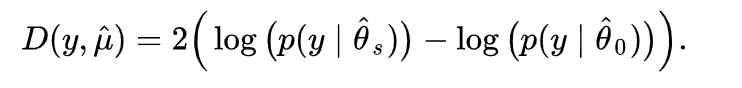

```{r setup, include=FALSE}
knitr::opts_chunk$set(echo = TRUE)
```

# Previo

## Paquetería

```{r, warning=FALSE}
#install.packages("sjPlot", dependencies=T) # solito porque da problmas
library(sjPlot)

if (!require("pacman")) install.packages("pacman") # instala pacman si se requiere
pacman::p_load(tidyverse, # sobretodo para dplyr
              haven, #importación
              janitor, #tablas
              sjlabelled, # etiquetas
              DescTools, # Paquete para estimaciones y pruebas
              infer, # tidy way 
              broom,  # Una escobita para limpiar (pero es para arreglar)
              estimatr, car, stargazer, ggpubr, 
              jtools, lm.beta, robustbase, sandwich,
              officer,flextable,huxtable, ggstance, kableExtra,
               ResourceSelection, lmtest, mlogit, nnet) # Nuevos

```


#  Datos

```{r}
ags_t321 <- read_dta("./datos/AGS_SDEMT321.dta", encoding="latin1") %>% 
  clean_names()

```


# Sub-setting para comparar modelos
Vamos a hacer una sub-base de nuestras posibles variables explicativas. Esto es importante porque sólo podemos comparar modelos con la misma cantidad de observaciones.


```{r}
mydata<- ags_t321 %>% 
  filter(clase2==1) %>%  # me quedo con la población ocupada
  filter(ing_x_hrs>0) %>% # ingresos válidos
  filter(anios_esc<99) %>% # quito missings anios de escolaridad
  filter(eda>14 & eda<99) %>% #PET
  mutate(sex=as_label(sex)) %>% # Ojo, hicimos este cambio en la práctica pasada
  select(eda, sex, anios_esc, ing_x_hrs, pos_ocu, imssissste, medica5c, ent)  
  
tail(mydata)

```


Vamos a volver dicotómica (0,1) nuestra variable [y de paso repasamos cómo se recodifica en R]
```{r}
mydata$y_binomial<-mydata$imssissste<4
mydata$y_binomial<-as_numeric(mydata$y_binomial)

mydata %>% 
  tabyl(y_binomial)


```

# Introducción
En esta práctica vamos a revisar los elementos básicos para la regresión logística. El proceso en R para todos los modelos generalizados se parece mucho. Por tanto, no será difícil que luego puedas utilizar otras funciones de enlace.

Vamos a hacer una sub-base de nuestras posibles variables explicativas. Esto es importante porque sólo podemos comparar modelos con la misma cantidad de observaciones. Intentaremos predecir la participación económica


# Regresión Logística

$$ ln\frac{p(x=1)}{p(x=0)}=\beta_o+\beta_1x +\epsilon$$


## Un solo predictor

```{r}
modelo0<-glm(y_binomial ~ anios_esc, family = binomial("logit"), data=mydata, na.action=na.exclude)
summary(modelo0)
confint(modelo0)

```

Con jtools:
```{r}
summ(modelo0)
```


## Predicción de probabilidades
Para predecir la probabilidad, primero chequemos el rango de nuestra variabe explicativa
```{r}
range(mydata$anios_esc)
```

Hacemos un vector con los valores que queremos predecir
```{r}
xanios_esc <- 0:25
```

Vamos a utilizar el comando "predict" para predecir los valores. Podemos el argumento "response" para que nos dé el logito
```{r}
y_logito <- predict(modelo0, list(anios_esc = xanios_esc))
y_prob<- predict(modelo0, list(anios_esc = xanios_esc), type= "response")

results_m0<-cbind(y_logito, y_prob, xanios_esc)
results_m0<-as.data.frame(results_m0)
```

Hoy podemos graficar


```{r}
ggplot(data=results_m0, aes(x=xanios_esc, y=y_prob)) +
  geom_point()

```

## Coeficientes exponenciados


Para interpretar mejor los coeficientes suelen exponenciarse y hablar de las veces que aumentan o disminuyen los momios con respecto a la unidad como base. Si exponenciamos a ambos lados de nuestra ecuación:


$$ e^{ln\frac{p(x=1)}{p(x=0)}}=e^{\beta_o+\beta_1x +\epsilon}$$

$$ \frac{p(x=1)}{p(x=0)}=e^{\beta_o+\beta_1x +\epsilon}$$
Al exponenciar los coeficientes, tenemos los resultados en términos de momios.


$$ \frac{p}{1-p}=e^{\beta_o}*+*e^{\beta_1x}*e^{\epsilon}$$
Por tantopodemos establecer por cuánto se multiplican los momios de probabilidad. Lo cual es una manera más sencilla para interpretar nuestros resultados
 
```{r}

exp(coef(modelo0))

```


Es muy fácil con la librería jtools, sacar los coeficientes exponenciados. La ventaja es que nos dan también los intervalos:
```{r}
summ(modelo0, exp=T )

```

## Agregando una variable 


```{r}
modelo1<-glm(y_binomial ~ anios_esc + sex, family = binomial("logit"), data=mydata, na.action=na.exclude)
summary(modelo1)
confint(modelo1)
```

Este modelo tiene coeficientes que deben leerse "condicionados". Es decir, en este caso tenemos que el coeficiente asociado a la anios_esc, mantiene constante el sexo y viceversa.

Veamos con los valores exponenciados:

```{r}

```


## Bondad de Ajuste

### Devianza
La devianza es una medida de la bondad de ajuste de los modelos lineales generalizados. O más bien, es una medida de la no-bondad del ajust, puesto que valores más altos indican un peor ajuste.

R nos da medidas de devianza: la devianza nula y la desviación residual. La devianza nula muestra qué tan bien la variable de respuesta se predice mediante un modelo que incluye solo la intersección (gran media).

 
### Prueba de Verosimilitud



¿Cómo saber si ha mejorado nuestro modelo? Podemos hacer un test que compare las devianzas(tendría la misma lógica que nuestra prueba F del modelo lineal). Para esto tenemos que instalar un paquete "lmtest"
```{r}
lrtest0<-lrtest(modelo0, modelo1)
lrtest0
```

Como puedes ver, el resultado muestra un valor p muy pequeño (<.001). Esto significa que agregar el sexo al modelo lleva a un ajuste significativamente mejor sobre el modelo original.

Podemos seguir añadiendo variables sólo "sumando" en la función

```{r}
modelo2<-glm(y_binomial ~ anios_esc + sex + eda,
             family = binomial("logit"), 
             data=mydata, 
             na.action=na.exclude)
summary(modelo2)

```


Y podemos ver si introducir esta variable afectó al ajuste global del modelo
```{r}
lrtest1<-lrtest(modelo1, modelo2)
lrtest1
```


### Test Hosmer-Lemeshow Goodness of Fit "GOF"

El teste Homer-Lemeshow se calcula sobre los datos una vez que las observaciones se han segmentado en grupos basados en probabilidades predichas similares. 
Este teste examina si las proporciones observadas de eventos son similares a las probabilidades predichas de ocurrencia en subgrupos del conjunto de datos, y lo hace con  una prueba de chi cuadrado de Pearson.

¡Ojo! No queremos rechazar la hipótesis nula. La hipótesis nula sostiene que el modelo se ajusta a los datos por lo tanto no queremos rechazarla.

```{r}

hoslem.test(mydata$y_binomial, fitted(modelo2))

```

No obstante, esta prueba ha sido criticada. Checa la postura de Paul Allison <https://statisticalhorizons.com/hosmer-lemeshow>

Es un problema que tenemos en muestras grandes.
Casi siempre preferimos el enfoque de la devianza.


## Tabla de modelos estimados

```{r mylatextable}
#stargazer(modelo0, modelo1,modelo2, type = 'latex', header=FALSE)

```

```{r mytextable2}
stargazer(modelo0, modelo1,modelo2, 
          type = 'text', header=FALSE)
        

```
Para sacar los coeficientes exponenciados
```{r}
stargazer(modelo0, modelo1,modelo2, 
          type = 'text', header=FALSE,
          apply.coef = exp,
          apply.se   = exp)

```

Veamos con jtools:

```{r}
export_summs(modelo0, modelo1,modelo2, exp=T)

```


También la librería "sjPlot" tiene el comando "plot_model()"

```{r}
plot_model(modelo2)
```

Por default nos da los coeficientes exponenciados.

¿Cómo saber lo que tiene esos gráficos? Es bueno guardar siempre estos resultados en un objeto. Este objeto es una lista de dos listas

```{r}
get<-plot_model(modelo2)
get$data

```


```{r}
plot_model(modelo2, terms= c("anios_esc", "sex"), type="pred")

```

Para poner más de un modelo:

```{r}
plot_models(modelo1, modelo2) + ggtitle("P(acceso a servicios médicos)")
```


# Regresión Probit

## Un solo predictor

```{r}
mprobit<-glm(y_binomial ~ anios_esc, family = binomial("probit"), data=mydata, na.action=na.exclude)
summary(mprobit)


```

Comparando probit con logit:

```{r}
stargazer(modelo0, mprobit,   type = 'text', header=FALSE)
```

¿Cuál es la diferencia?


<https://tutorials.methodsconsultants.com/posts/what-is-the-difference-between-logit-and-probit-models>.

Y Allison:

<https://statisticalhorizons.com/in-defense-of-logit-part-1>
<https://statisticalhorizons.com/in-defense-of-logit-part-2>


