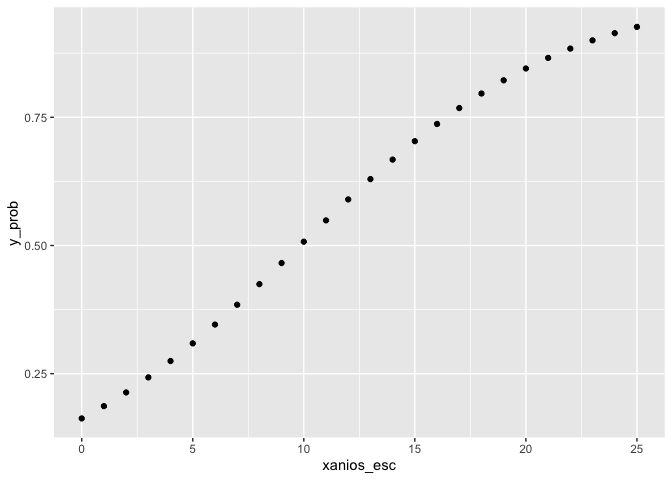
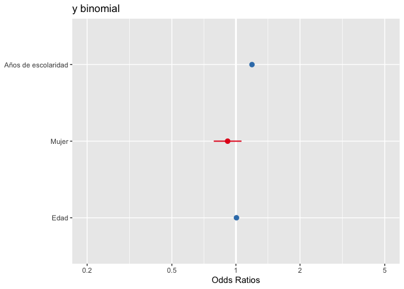
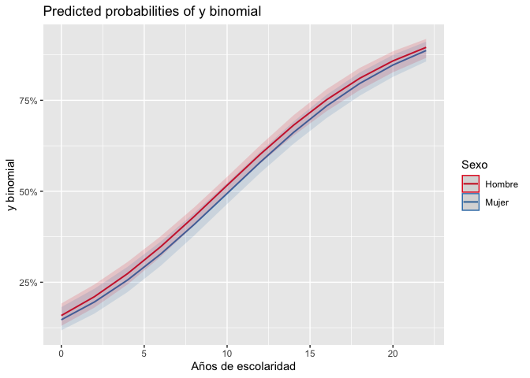
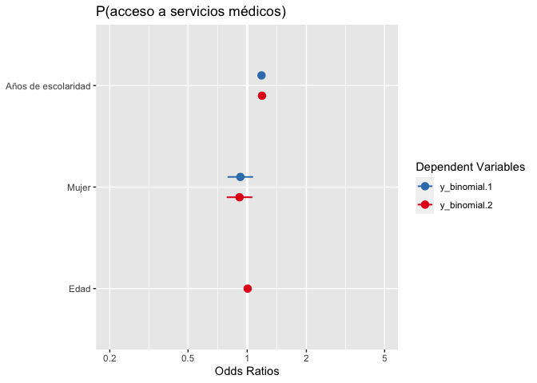

Práctica 5
================
Ana Escoto
24/06/2022

-   [Previo](#previo)
    -   [Paquetería](#paquetería)
-   [Datos](#datos)
-   [Sub-setting para comparar
    modelos](#sub-setting-para-comparar-modelos)
-   [Introducción](#introducción)
-   [Regresión Logística](#regresión-logística)
    -   [Un solo predictor](#un-solo-predictor)
    -   [Predicción de probabilidades](#predicción-de-probabilidades)
    -   [Coeficientes exponenciados](#coeficientes-exponenciados)
    -   [Agregando una variable](#agregando-una-variable)
    -   [Bondad de Ajuste](#bondad-de-ajuste)
    -   [Tabla de modelos estimados](#tabla-de-modelos-estimados)
-   [Regresión Probit](#regresión-probit)
    -   [Un solo predictor](#un-solo-predictor-1)

# Previo

## Paquetería

``` r
#install.packages("sjPlot", dependencies=T) # solito porque da problmas
library(sjPlot)
```

    ## Learn more about sjPlot with 'browseVignettes("sjPlot")'.

``` r
if (!require("pacman")) install.packages("pacman") # instala pacman si se requiere
```

    ## Loading required package: pacman

``` r
pacman::p_load(tidyverse, # sobretodo para dplyr
              haven, #importación
              janitor, #tablas
              sjlabelled, # etiquetas
              DescTools, # Paquete para estimaciones y pruebas
              infer, # tidy way 
              broom,  # Una escobita para limpiar (pero es para arreglar)
              estimatr, car, stargazer, ggpubr, 
              jtools, lm.beta, robustbase, sandwich,
              officer,flextable,huxtable, ggstance, kableExtra,
               ResourceSelection, lmtest, mlogit, nnet) # Nuevos
```

# Datos

``` r
ags_t321 <- read_dta("./datos/AGS_SDEMT321.dta", encoding="latin1") %>% 
  clean_names()
```

# Sub-setting para comparar modelos

Vamos a hacer una sub-base de nuestras posibles variables explicativas.
Esto es importante porque sólo podemos comparar modelos con la misma
cantidad de observaciones.

``` r
mydata<- ags_t321 %>% 
  filter(clase2==1) %>%  # me quedo con la población ocupada
  filter(ing_x_hrs>0) %>% # ingresos válidos
  filter(anios_esc<99) %>% # quito missings anios de escolaridad
  filter(eda>14 & eda<99) %>% #PET
  mutate(sex=as_label(sex)) %>% # Ojo, hicimos este cambio en la práctica pasada
  select(eda, sex, anios_esc, ing_x_hrs, pos_ocu, imssissste, medica5c, ent)  
  
tail(mydata)
```

    ## Warning in knit_print.huxtable(ht): Unrecognized output format "gfm-yaml". Using `to_screen` to print huxtables.
    ## Set options("huxtable.knitr_output_format") manually to "latex", "html", "rtf", "docx", "pptx", "md" or "screen".

     ┌─────────────────────────────────────────────────────────────────────
     │ eda   sex      anios_es   ing_x_hr   pos_ocu   imssisss   medica5c  
     │                       c          s             te                   
     ├─────────────────────────────────────────────────────────────────────
     │  45   Mujer          17       77.5   1         1          3         
     │  31   Hombre          9       37.5   1         1          3         
     │  31   Hombre          9       54.5   1         4          1         
     │  29   Mujer           9       40     1         4          1         
     │  27   Hombre          6       37.7   1         1          3         
     │  30   Mujer           9       37.5   1         1          3         
     └─────────────────────────────────────────────────────────────────────

Column names: eda, sex, anios_esc, ing_x\_hrs, pos_ocu, imssissste,
medica5c, ent

7/8 columns shown.

Vamos a volver dicotómica (0,1) nuestra variable \[y de paso repasamos
cómo se recodifica en R\]

``` r
mydata$y_binomial<-mydata$imssissste<4
mydata$y_binomial<-as_numeric(mydata$y_binomial)

mydata %>% 
  tabyl(y_binomial)
```

    ## Warning in knit_print.huxtable(ht): Unrecognized output format "gfm-yaml". Using `to_screen` to print huxtables.
    ## Set options("huxtable.knitr_output_format") manually to "latex", "html", "rtf", "docx", "pptx", "md" or "screen".

                        ┌──────────────────────────────┐
                        │ y_binomial       n   percent │
                        ├──────────────────────────────┤
                        │          0    1539     0.483 │
                        │          1    1648     0.517 │
                        └──────────────────────────────┘

Column names: y_binomial, n, percent

# Introducción

En esta práctica vamos a revisar los elementos básicos para la regresión
logística. El proceso en R para todos los modelos generalizados se
parece mucho. Por tanto, no será difícil que luego puedas utilizar otras
funciones de enlace.

Vamos a hacer una sub-base de nuestras posibles variables explicativas.
Esto es importante porque sólo podemos comparar modelos con la misma
cantidad de observaciones. Intentaremos predecir la participación
económica

# Regresión Logística

}{p(x=0)}=\beta_o+\beta_1x +\epsilon")

## Un solo predictor

``` r
modelo0<-glm(y_binomial ~ anios_esc, family = binomial("logit"), data=mydata, na.action=na.exclude)
summary(modelo0)
```

    ## 
    ## Call:
    ## glm(formula = y_binomial ~ anios_esc, family = binomial("logit"), 
    ##     data = mydata, na.action = na.exclude)
    ## 
    ## Deviance Residuals: 
    ##     Min       1Q   Median       3Q      Max  
    ## -1.8582  -1.1198   0.7266   1.0275   1.9056  
    ## 
    ## Coefficients:
    ##             Estimate Std. Error z value Pr(>|z|)    
    ## (Intercept) -1.63794    0.11243  -14.57   <2e-16 ***
    ## anios_esc    0.16677    0.01044   15.98   <2e-16 ***
    ## ---
    ## Signif. codes:  0 '***' 0.001 '**' 0.01 '*' 0.05 '.' 0.1 ' ' 1
    ## 
    ## (Dispersion parameter for binomial family taken to be 1)
    ## 
    ##     Null deviance: 4414.4  on 3186  degrees of freedom
    ## Residual deviance: 4123.5  on 3185  degrees of freedom
    ## AIC: 4127.5
    ## 
    ## Number of Fisher Scoring iterations: 4

``` r
confint(modelo0)
```

    ## Waiting for profiling to be done...

    ##                  2.5 %     97.5 %
    ## (Intercept) -1.8602143 -1.4193833
    ## anios_esc    0.1465036  0.1874302

Con jtools:

``` r
summ(modelo0)
```

<table class="table table-striped table-hover table-condensed table-responsive" style="width: auto !important; margin-left: auto; margin-right: auto;">
<tbody>
<tr>
<td style="text-align:left;font-weight: bold;">
Observations
</td>
<td style="text-align:right;">
3187
</td>
</tr>
<tr>
<td style="text-align:left;font-weight: bold;">
Dependent variable
</td>
<td style="text-align:right;">
y_binomial
</td>
</tr>
<tr>
<td style="text-align:left;font-weight: bold;">
Type
</td>
<td style="text-align:right;">
Generalized linear model
</td>
</tr>
<tr>
<td style="text-align:left;font-weight: bold;">
Family
</td>
<td style="text-align:right;">
binomial
</td>
</tr>
<tr>
<td style="text-align:left;font-weight: bold;">
Link
</td>
<td style="text-align:right;">
logit
</td>
</tr>
</tbody>
</table>
<table class="table table-striped table-hover table-condensed table-responsive" style="width: auto !important; margin-left: auto; margin-right: auto;">
<tbody>
<tr>
<td style="text-align:left;font-weight: bold;">
𝛘²(1)
</td>
<td style="text-align:right;">
290.88
</td>
</tr>
<tr>
<td style="text-align:left;font-weight: bold;">
Pseudo-R² (Cragg-Uhler)
</td>
<td style="text-align:right;">
0.12
</td>
</tr>
<tr>
<td style="text-align:left;font-weight: bold;">
Pseudo-R² (McFadden)
</td>
<td style="text-align:right;">
0.07
</td>
</tr>
<tr>
<td style="text-align:left;font-weight: bold;">
AIC
</td>
<td style="text-align:right;">
4127.51
</td>
</tr>
<tr>
<td style="text-align:left;font-weight: bold;">
BIC
</td>
<td style="text-align:right;">
4139.65
</td>
</tr>
</tbody>
</table>
<table class="table table-striped table-hover table-condensed table-responsive" style="width: auto !important; margin-left: auto; margin-right: auto;border-bottom: 0;">
<thead>
<tr>
<th style="text-align:left;">
</th>
<th style="text-align:right;">
Est.
</th>
<th style="text-align:right;">
S.E.
</th>
<th style="text-align:right;">
z val.
</th>
<th style="text-align:right;">
p
</th>
</tr>
</thead>
<tbody>
<tr>
<td style="text-align:left;font-weight: bold;">
(Intercept)
</td>
<td style="text-align:right;">
-1.64
</td>
<td style="text-align:right;">
0.11
</td>
<td style="text-align:right;">
-14.57
</td>
<td style="text-align:right;">
0.00
</td>
</tr>
<tr>
<td style="text-align:left;font-weight: bold;">
anios_esc
</td>
<td style="text-align:right;">
0.17
</td>
<td style="text-align:right;">
0.01
</td>
<td style="text-align:right;">
15.98
</td>
<td style="text-align:right;">
0.00
</td>
</tr>
</tbody>
<tfoot>
<tr>
<td style="padding: 0; " colspan="100%">
<sup></sup> Standard errors: MLE
</td>
</tr>
</tfoot>
</table>

## Predicción de probabilidades

Para predecir la probabilidad, primero chequemos el rango de nuestra
variabe explicativa

``` r
range(mydata$anios_esc)
```

    ## [1]  0 21

Hacemos un vector con los valores que queremos predecir

``` r
xanios_esc <- 0:25
```

Vamos a utilizar el comando “predict” para predecir los valores. Podemos
el argumento “response” para que nos dé el logito

``` r
y_logito <- predict(modelo0, list(anios_esc = xanios_esc))
y_prob<- predict(modelo0, list(anios_esc = xanios_esc), type= "response")

results_m0<-cbind(y_logito, y_prob, xanios_esc)
results_m0<-as.data.frame(results_m0)
```

Hoy podemos graficar

``` r
ggplot(data=results_m0, aes(x=xanios_esc, y=y_prob)) +
  geom_point()
```

<!-- -->

## Coeficientes exponenciados

Para interpretar mejor los coeficientes suelen exponenciarse y hablar de
las veces que aumentan o disminuyen los momios con respecto a la unidad
como base. Si exponenciamos a ambos lados de nuestra ecuación:

}{p(x=0)}}=e^{\beta_o+\beta_1x +\epsilon}")

}{p(x=0)}=e^{\beta_o+\beta_1x +\epsilon}")

Al exponenciar los coeficientes, tenemos los resultados en términos de
momios.


Por tantopodemos establecer por cuánto se multiplican los momios de
probabilidad. Lo cual es una manera más sencilla para interpretar
nuestros resultados

``` r
exp(coef(modelo0))
```

    ## (Intercept)   anios_esc 
    ##   0.1943804   1.1814788

Es muy fácil con la librería jtools, sacar los coeficientes
exponenciados. La ventaja es que nos dan también los intervalos:

``` r
summ(modelo0, exp=T )
```

<table class="table table-striped table-hover table-condensed table-responsive" style="width: auto !important; margin-left: auto; margin-right: auto;">
<tbody>
<tr>
<td style="text-align:left;font-weight: bold;">
Observations
</td>
<td style="text-align:right;">
3187
</td>
</tr>
<tr>
<td style="text-align:left;font-weight: bold;">
Dependent variable
</td>
<td style="text-align:right;">
y_binomial
</td>
</tr>
<tr>
<td style="text-align:left;font-weight: bold;">
Type
</td>
<td style="text-align:right;">
Generalized linear model
</td>
</tr>
<tr>
<td style="text-align:left;font-weight: bold;">
Family
</td>
<td style="text-align:right;">
binomial
</td>
</tr>
<tr>
<td style="text-align:left;font-weight: bold;">
Link
</td>
<td style="text-align:right;">
logit
</td>
</tr>
</tbody>
</table>
<table class="table table-striped table-hover table-condensed table-responsive" style="width: auto !important; margin-left: auto; margin-right: auto;">
<tbody>
<tr>
<td style="text-align:left;font-weight: bold;">
𝛘²(1)
</td>
<td style="text-align:right;">
290.88
</td>
</tr>
<tr>
<td style="text-align:left;font-weight: bold;">
Pseudo-R² (Cragg-Uhler)
</td>
<td style="text-align:right;">
0.12
</td>
</tr>
<tr>
<td style="text-align:left;font-weight: bold;">
Pseudo-R² (McFadden)
</td>
<td style="text-align:right;">
0.07
</td>
</tr>
<tr>
<td style="text-align:left;font-weight: bold;">
AIC
</td>
<td style="text-align:right;">
4127.51
</td>
</tr>
<tr>
<td style="text-align:left;font-weight: bold;">
BIC
</td>
<td style="text-align:right;">
4139.65
</td>
</tr>
</tbody>
</table>
<table class="table table-striped table-hover table-condensed table-responsive" style="width: auto !important; margin-left: auto; margin-right: auto;border-bottom: 0;">
<thead>
<tr>
<th style="text-align:left;">
</th>
<th style="text-align:right;">
exp(Est.)
</th>
<th style="text-align:right;">
2.5%
</th>
<th style="text-align:right;">
97.5%
</th>
<th style="text-align:right;">
z val.
</th>
<th style="text-align:right;">
p
</th>
</tr>
</thead>
<tbody>
<tr>
<td style="text-align:left;font-weight: bold;">
(Intercept)
</td>
<td style="text-align:right;">
0.19
</td>
<td style="text-align:right;">
0.16
</td>
<td style="text-align:right;">
0.24
</td>
<td style="text-align:right;">
-14.57
</td>
<td style="text-align:right;">
0.00
</td>
</tr>
<tr>
<td style="text-align:left;font-weight: bold;">
anios_esc
</td>
<td style="text-align:right;">
1.18
</td>
<td style="text-align:right;">
1.16
</td>
<td style="text-align:right;">
1.21
</td>
<td style="text-align:right;">
15.98
</td>
<td style="text-align:right;">
0.00
</td>
</tr>
</tbody>
<tfoot>
<tr>
<td style="padding: 0; " colspan="100%">
<sup></sup> Standard errors: MLE
</td>
</tr>
</tfoot>
</table>

## Agregando una variable

``` r
modelo1<-glm(y_binomial ~ anios_esc + sex, family = binomial("logit"), data=mydata, na.action=na.exclude)
summary(modelo1)
```

    ## 
    ## Call:
    ## glm(formula = y_binomial ~ anios_esc + sex, family = binomial("logit"), 
    ##     data = mydata, na.action = na.exclude)
    ## 
    ## Deviance Residuals: 
    ##     Min       1Q   Median       3Q      Max  
    ## -1.8761  -1.1325   0.7144   1.0463   1.9312  
    ## 
    ## Coefficients:
    ##             Estimate Std. Error z value Pr(>|z|)    
    ## (Intercept) -1.61634    0.11421 -14.152   <2e-16 ***
    ## anios_esc    0.16775    0.01049  15.998   <2e-16 ***
    ## sexMujer    -0.08015    0.07627  -1.051    0.293    
    ## ---
    ## Signif. codes:  0 '***' 0.001 '**' 0.01 '*' 0.05 '.' 0.1 ' ' 1
    ## 
    ## (Dispersion parameter for binomial family taken to be 1)
    ## 
    ##     Null deviance: 4414.4  on 3186  degrees of freedom
    ## Residual deviance: 4122.4  on 3184  degrees of freedom
    ## AIC: 4128.4
    ## 
    ## Number of Fisher Scoring iterations: 4

``` r
confint(modelo1)
```

    ## Waiting for profiling to be done...

    ##                  2.5 %      97.5 %
    ## (Intercept) -1.8420895 -1.39427117
    ## anios_esc    0.1473969  0.18851372
    ## sexMujer    -0.2297571  0.06925385

Este modelo tiene coeficientes que deben leerse “condicionados”. Es
decir, en este caso tenemos que el coeficiente asociado a la anios_esc,
mantiene constante el sexo y viceversa.

Veamos con los valores exponenciados:

## Bondad de Ajuste

### Devianza

La devianza es una medida de la bondad de ajuste de los modelos lineales
generalizados. O más bien, es una medida de la no-bondad del ajust,
puesto que valores más altos indican un peor ajuste.

R nos da medidas de devianza: la devianza nula y la desviación residual.
La devianza nula muestra qué tan bien la variable de respuesta se
predice mediante un modelo que incluye solo la intersección (gran
media).

### Prueba de Verosimilitud


¿Cómo saber si ha mejorado nuestro modelo? Podemos hacer un test que
compare las devianzas(tendría la misma lógica que nuestra prueba F del
modelo lineal). Para esto tenemos que instalar un paquete “lmtest”

``` r
lrtest0<-lrtest(modelo0, modelo1)
lrtest0
```

    ## Warning in knit_print.huxtable(ht): Unrecognized output format "gfm-yaml". Using `to_screen` to print huxtables.
    ## Set options("huxtable.knitr_output_format") manually to "latex", "html", "rtf", "docx", "pptx", "md" or "screen".

                 ┌────────────────────────────────────────────┐
                 │ #Df      LogLik    Df   Chisq   Pr(>Chisq) │
                 ├────────────────────────────────────────────┤
                 │   2   -2.06e+03                            │
                 │   3   -2.06e+03     1    1.11        0.293 │
                 └────────────────────────────────────────────┘

Column names: \#Df, LogLik, Df, Chisq, Pr(\>Chisq)

Como puedes ver, el resultado muestra un valor p muy pequeño (\<.001).
Esto significa que agregar el sexo al modelo lleva a un ajuste
significativamente mejor sobre el modelo original.

Podemos seguir añadiendo variables sólo “sumando” en la función

``` r
modelo2<-glm(y_binomial ~ anios_esc + sex + eda,
             family = binomial("logit"), 
             data=mydata, 
             na.action=na.exclude)
summary(modelo2)
```

    ## 
    ## Call:
    ## glm(formula = y_binomial ~ anios_esc + sex + eda, family = binomial("logit"), 
    ##     data = mydata, na.action = na.exclude)
    ## 
    ## Deviance Residuals: 
    ##    Min      1Q  Median      3Q     Max  
    ## -1.884  -1.105   0.681   1.084   1.924  
    ## 
    ## Coefficients:
    ##              Estimate Std. Error z value Pr(>|z|)    
    ## (Intercept) -1.881129   0.175398 -10.725   <2e-16 ***
    ## anios_esc    0.173549   0.010923  15.888   <2e-16 ***
    ## sexMujer    -0.089946   0.076474  -1.176   0.2395    
    ## eda          0.005598   0.002792   2.005   0.0449 *  
    ## ---
    ## Signif. codes:  0 '***' 0.001 '**' 0.01 '*' 0.05 '.' 0.1 ' ' 1
    ## 
    ## (Dispersion parameter for binomial family taken to be 1)
    ## 
    ##     Null deviance: 4414.4  on 3186  degrees of freedom
    ## Residual deviance: 4118.4  on 3183  degrees of freedom
    ## AIC: 4126.4
    ## 
    ## Number of Fisher Scoring iterations: 4

Y podemos ver si introducir esta variable afectó al ajuste global del
modelo

``` r
lrtest1<-lrtest(modelo1, modelo2)
lrtest1
```

    ## Warning in knit_print.huxtable(ht): Unrecognized output format "gfm-yaml". Using `to_screen` to print huxtables.
    ## Set options("huxtable.knitr_output_format") manually to "latex", "html", "rtf", "docx", "pptx", "md" or "screen".

                 ┌────────────────────────────────────────────┐
                 │ #Df      LogLik    Df   Chisq   Pr(>Chisq) │
                 ├────────────────────────────────────────────┤
                 │   3   -2.06e+03                            │
                 │   4   -2.06e+03     1    4.03       0.0446 │
                 └────────────────────────────────────────────┘

Column names: \#Df, LogLik, Df, Chisq, Pr(\>Chisq)

### Test Hosmer-Lemeshow Goodness of Fit “GOF”

El teste Homer-Lemeshow se calcula sobre los datos una vez que las
observaciones se han segmentado en grupos basados en probabilidades
predichas similares. Este teste examina si las proporciones observadas
de eventos son similares a las probabilidades predichas de ocurrencia en
subgrupos del conjunto de datos, y lo hace con una prueba de chi
cuadrado de Pearson.

¡Ojo! No queremos rechazar la hipótesis nula. La hipótesis nula sostiene
que el modelo se ajusta a los datos por lo tanto no queremos rechazarla.

``` r
hoslem.test(mydata$y_binomial, fitted(modelo2))
```

    ## 
    ##  Hosmer and Lemeshow goodness of fit (GOF) test
    ## 
    ## data:  mydata$y_binomial, fitted(modelo2)
    ## X-squared = 29.885, df = 8, p-value = 0.0002215

No obstante, esta prueba ha sido criticada. Checa la postura de Paul
Allison <https://statisticalhorizons.com/hosmer-lemeshow>

Es un problema que tenemos en muestras grandes. Casi siempre preferimos
el enfoque de la devianza.

## Tabla de modelos estimados

``` r
#stargazer(modelo0, modelo1,modelo2, type = 'latex', header=FALSE)
```

``` r
stargazer(modelo0, modelo1,modelo2, 
          type = 'text', header=FALSE)
```

    ## 
    ## ==================================================
    ##                         Dependent variable:       
    ##                   --------------------------------
    ##                              y_binomial           
    ##                      (1)        (2)        (3)    
    ## --------------------------------------------------
    ## anios_esc          0.167***   0.168***   0.174*** 
    ##                    (0.010)    (0.010)    (0.011)  
    ##                                                   
    ## sexMujer                       -0.080     -0.090  
    ##                               (0.076)    (0.076)  
    ##                                                   
    ## eda                                      0.006**  
    ##                                          (0.003)  
    ##                                                   
    ## Constant          -1.638***  -1.616***  -1.881*** 
    ##                    (0.112)    (0.114)    (0.175)  
    ##                                                   
    ## --------------------------------------------------
    ## Observations        3,187      3,187      3,187   
    ## Log Likelihood    -2,061.757 -2,061.204 -2,059.188
    ## Akaike Inf. Crit. 4,127.514  4,128.409  4,126.375 
    ## ==================================================
    ## Note:                  *p<0.1; **p<0.05; ***p<0.01

Para sacar los coeficientes exponenciados

``` r
stargazer(modelo0, modelo1,modelo2, 
          type = 'text', header=FALSE,
          apply.coef = exp,
          apply.se   = exp)
```

    ## 
    ## ==================================================
    ##                         Dependent variable:       
    ##                   --------------------------------
    ##                              y_binomial           
    ##                      (1)        (2)        (3)    
    ## --------------------------------------------------
    ## anios_esc           1.181      1.183      1.190   
    ##                    (1.010)    (1.011)    (1.011)  
    ##                                                   
    ## sexMujer                       0.923      0.914   
    ##                               (1.079)    (1.079)  
    ##                                                   
    ## eda                                       1.006   
    ##                                          (1.003)  
    ##                                                   
    ## Constant            0.194      0.199      0.152   
    ##                    (1.119)    (1.121)    (1.192)  
    ##                                                   
    ## --------------------------------------------------
    ## Observations        3,187      3,187      3,187   
    ## Log Likelihood    -2,061.757 -2,061.204 -2,059.188
    ## Akaike Inf. Crit. 4,127.514  4,128.409  4,126.375 
    ## ==================================================
    ## Note:                  *p<0.1; **p<0.05; ***p<0.01

Veamos con jtools:

``` r
export_summs(modelo0, modelo1,modelo2, exp=T)
```

    ## Warning in knit_print.huxtable(x, ...): Unrecognized output format "gfm-yaml". Using `to_screen` to print huxtables.
    ## Set options("huxtable.knitr_output_format") manually to "latex", "html", "rtf", "docx", "pptx", "md" or "screen".

           ─────────────────────────────────────────────────────────
                             Model 1       Model 2       Model 3    
                         ───────────────────────────────────────────
             (Intercept)      0.19 ***      0.20 ***      0.15 ***  
                             (0.11)        (0.11)        (0.18)     
             anios_esc        1.18 ***      1.18 ***      1.19 ***  
                             (0.01)        (0.01)        (0.01)     
             sexMujer                       0.92          0.91      
                                           (0.08)        (0.08)     
             eda                                          1.01 *    
                                                         (0.00)     
                         ───────────────────────────────────────────
             N             3187          3187          3187         
             AIC           4127.51       4128.41       4126.38      
             BIC           4139.65       4146.61       4150.64      
             Pseudo R2        0.12          0.12          0.12      
           ─────────────────────────────────────────────────────────
             *** p < 0.001; ** p < 0.01; * p < 0.05.                

Column names: names, Model 1, Model 2, Model 3

También la librería “sjPlot” tiene el comando “plot_model()”

``` r
plot_model(modelo2)
```

<!-- -->

Por default nos da los coeficientes exponenciados.

¿Cómo saber lo que tiene esos gráficos? Es bueno guardar siempre estos
resultados en un objeto. Este objeto es una lista de dos listas

``` r
get<-plot_model(modelo2)
get$data
```

    ## Warning in knit_print.huxtable(ht): Unrecognized output format "gfm-yaml". Using `to_screen` to print huxtables.
    ## Set options("huxtable.knitr_output_format") manually to "latex", "html", "rtf", "docx", "pptx", "md" or "screen".

┌─────────────────────────────────────────────────────────────────────────────
│ term estimate std.erro conf.lev conf.low conf.hig statisti  
│ r el h c  
├─────────────────────────────────────────────────────────────────────────────
│ anios_es 1.19  0.0109  0.95 1.16  1.22 15.9   
│ c  
│ sexMujer 0.914 0.0765  0.95 0.787 1.06 -1.18  
│ eda 1.01  0.00279 0.95 1     1.01 2.01  
└─────────────────────────────────────────────────────────────────────────────

Column names: term, estimate, std.error, conf.level, conf.low,
conf.high, statistic, df.error, p.value, p.stars, p.label, group, xpos,
xmin, xmax

7/15 columns shown.

``` r
plot_model(modelo2, terms= c("anios_esc", "sex"), type="pred")
```

    ## Data were 'prettified'. Consider using `terms="anios_esc [all]"` to get smooth plots.

<!-- -->

Para poner más de un modelo:

``` r
plot_models(modelo1, modelo2) + ggtitle("P(acceso a servicios médicos)")
```

<!-- -->

# Regresión Probit

## Un solo predictor

``` r
mprobit<-glm(y_binomial ~ anios_esc, family = binomial("probit"), data=mydata, na.action=na.exclude)
summary(mprobit)
```

    ## 
    ## Call:
    ## glm(formula = y_binomial ~ anios_esc, family = binomial("probit"), 
    ##     data = mydata, na.action = na.exclude)
    ## 
    ## Deviance Residuals: 
    ##     Min       1Q   Median       3Q      Max  
    ## -1.8696  -1.1203   0.7261   1.0310   1.9233  
    ## 
    ## Coefficients:
    ##              Estimate Std. Error z value Pr(>|z|)    
    ## (Intercept) -1.005633   0.067344  -14.93   <2e-16 ***
    ## anios_esc    0.102283   0.006201   16.49   <2e-16 ***
    ## ---
    ## Signif. codes:  0 '***' 0.001 '**' 0.01 '*' 0.05 '.' 0.1 ' ' 1
    ## 
    ## (Dispersion parameter for binomial family taken to be 1)
    ## 
    ##     Null deviance: 4414.4  on 3186  degrees of freedom
    ## Residual deviance: 4124.1  on 3185  degrees of freedom
    ## AIC: 4128.1
    ## 
    ## Number of Fisher Scoring iterations: 4

Comparando probit con logit:

``` r
stargazer(modelo0, mprobit,   type = 'text', header=FALSE)
```

    ## 
    ## ==============================================
    ##                       Dependent variable:     
    ##                   ----------------------------
    ##                            y_binomial         
    ##                      logistic       probit    
    ##                        (1)            (2)     
    ## ----------------------------------------------
    ## anios_esc            0.167***      0.102***   
    ##                      (0.010)        (0.006)   
    ##                                               
    ## Constant            -1.638***      -1.006***  
    ##                      (0.112)        (0.067)   
    ##                                               
    ## ----------------------------------------------
    ## Observations          3,187          3,187    
    ## Log Likelihood      -2,061.757    -2,062.028  
    ## Akaike Inf. Crit.   4,127.514      4,128.056  
    ## ==============================================
    ## Note:              *p<0.1; **p<0.05; ***p<0.01

¿Cuál es la diferencia?

<https://tutorials.methodsconsultants.com/posts/what-is-the-difference-between-logit-and-probit-models>.

Y Allison:

<https://statisticalhorizons.com/in-defense-of-logit-part-1>
<https://statisticalhorizons.com/in-defense-of-logit-part-2>
